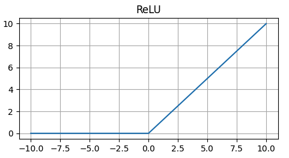
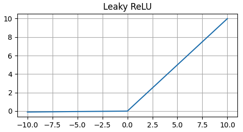
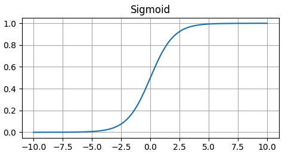
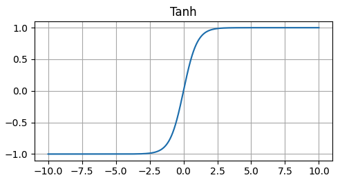
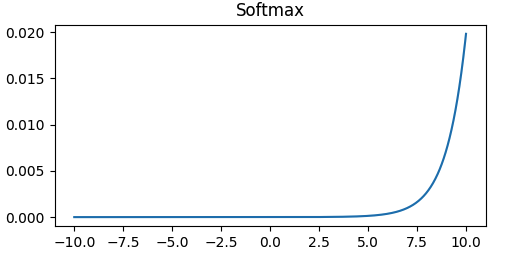

# hello AI world
농업 혁명, 산업 혁명, 인터넷 혁명에 이어 AI 혁명이 왔다. 소용돌이 같은 변화 속에서 흐름을 정신없이 좇다보면 흐릿한 사고 속에서 혼란만 가중된다. 이럴 때일수록 의심할 여지가 없는 기본 개념을 확실히 다져놓는게 결국 빠른 길일거라는 믿음 아래 기록을 시작해본다!

인공지능은 말그대로 인간의 지능을 기계로 모방해 구현해 놓은 걸 말한다.

> 왜 인간의 지능을 모방하려고 할까?

컴퓨터의 주된 역할은 문제 해결이다. 하지만, 물리법칙을 찾아내고 새로운 기술을 개발하는건 인간이 해왔다. 이러한 복잡하고 추상적인 개념을 이해하고 구체화시키는 일을 할 수 있는 인간의 뇌의 작동방식을 컴퓨터에 적용시킨다면 컴퓨터도 인간과 같은 일을 할 수 있지 않을까 하는 생각에서 출발한다.

*인공지능은 합리적인 인간을 모델로 삼는다.*
 
머신러닝은 인공지능의 한 분야로, 경험(데이터)을 통해 스스로 개선하는 방식이다. 머신러닝은 크게 지도학습, 비지도학습, 강화학습으로 나뉜다. 여기선 간단한 개념정리만 해둔다.

- **지도학습(Supervised Learning)**: 답이 주어진 여러 예제를 통해 학습하는 방식
- **비지도학습(Unsupervised Learning)**: 답이 주어지지 않은 여러 예제에서 패턴을 찾아 학습하는 방식
- **강화학습(Reinforcement Learning)**: 시행착오와 그에 따른 보상과 처벌 체계를 통해 학습하는 방식

> 그래서 어떻게 쓰는건데?

바로 본론으로 들어가서 머신러닝의 전체적인 워크플로우를 살펴보자.  

1. 어떤 문제를 해결할건지 명확히 해야한다. 주가 예측을 예시로 들어보자. 과거의 주가 데이터는 이미 제공된 값이다. 따라서 답이 주어진 여러 예시를 통해 학습하는 지도학습 방식을 선택할 수 있다.
2. 데이터를 수집하고, 전처리한다.
3. 모델을 설계하고, 학습시킨다.
4. 모델을 평가하고, 사용해 예측을 한다.
5. 예측 결과를 분석하고, 모델을 개선한다.

> 어떤 언어를 사용해야하나?

파이썬이 대세다. 파이썬은 데이터 분석과 머신러닝에 대한 라이브러리가 잘 갖춰져 있고, 사용하기 쉽다. 라이브러리로는 PyTorch를 사용한다. PyTorch는 페이스북에서 만든 딥러닝 라이브러리로, 유연하고 파이썬 기반으로 작동한다.

### 인공신경망 모델
데이터 수집과 전처리 과정은 나중에 자세히 알아보도록 하고, 인공신경망 모델의 작동 흐름을 좇아가보자.

뇌는 여러 층의 수많은 뉴런들이 시냅스로 얽혀 정보를 처리하고, 인공신경망은 이런 뇌의 구조를 모방한다. 인공신경망에서 층은 레이어, 뉴런은 노드, 시냅스는 노드 간 연결을 말한다. 뇌의 정보의 처리 과정은 순전파에 해당하고, 학습 과정은 역전파에 해당한다.

각 노드엔 `weight`(가중치)와 `bias`(편향)가 있다. 이를 `parameters`(매개변수)라고 하고 훈련이 진행됨에 따라 계속해서 수정되는 값이다. 기본적인 선형 회귀 모델은 *y = mx + b*이고, 여기서 m이 가중치, b가 편향이다. x 자리에 데이터를 입력하고 모델은 입력값에 대한 출력값을 예측한다. 이 예측값과 실제값의 차이를 계산해 손실을 구하고, 이 손실을 최소화하기 위해 m과 b를 업데이트합니다. 데이터가 입력으로 들어와 노드들이 있는 여러 층을 거쳐 예측값이 출력이 되는데 이 방향의 흐름을 `forward propagation`(순전파)이라고 한다. 이렇게 나온 예측치와 레이블(정답)의 오차를 계산하는 과정이 `loss function`이고, 이 오차를 최소화하기 위해 역방향으로 각 노드에 있는 weights와 biases를 수정해나가는걸 `optimizing`이라고 한다. 또한, 이런 역방향의 흐름을 `backward propagation`이라고 한다.

이 전체 흐름을 코드로 살펴보자.

```commandline
import torch
import torch.nn as nn

# Create a simple neural network
class SimpleNeuralNetwork(nn.Module):
    def __init__(self, input_size, output_size):
        super(SimpleNeuralNetwork, self).__init__()
        self.linear = nn.Linear(input_size, output_size)

    def forward(self, x):
        x = self.linear(x)
        return x

# Instantiate the model
simpy = SimpleNeuralNetwork(1, 1)

# Create a simple dataset
X = torch.tensor([[1.0], [2.0]])
y_hat = torch.tensor([[2.0], [4.0]])

# Set the hyperparameters
learning_rate = 0.01
epochs = 10

# Print the model parameters
print(f"Initial weights: {simpy.linear.weight}")
print(f"Initial bias: {simpy.linear.bias}")

for epoch in range(epochs):
    # Make a prediction
    y = simpy(X)
    print(f"Prediction before training: {y}")

    # Calculate the loss
    criterion = nn.MSELoss()
    loss = criterion(y, y_hat)
    print(f"Loss: {loss}")

    # Optimize the model
    optimizer = torch.optim.SGD(simpy.parameters(), lr=0.01)
    optimizer.zero_grad()
    loss.backward()
    optimizer.step()

    # Print the model parameters
    print(f"Updated weights: {simpy.linear.weight}")
    print(f"Updated bias: {simpy.linear.bias}")

    # Make a prediction
    y = simpy(X)
    print(f"Prediction after training: {y}")
    print(f"Loss: {criterion(y, y_hat)}")   
```

#### Input size, output size
input size는 모델에 공급될 데이터의 차원을 의미하고, ouput size는 모델이 예측하거나 출력할 데이터의 차원을 의미한다.

#### Activation function
활성화 함수가 없다면 뉴럴 네트워크는 단순한 선형 모델에 불과하기 때문에, 활성화 함수는 더 복잡한 패턴을 학습할 수 있도록 비선형성을 도입한다.
위의 예시 코드에서 사용한 Linear는 선형 함수이고, 이것만 적용한다면 유의미한 학습이 어려울 수 있다. 대표적인 비선형 함수는 아래와 같다.
1. ReLU(Rectified Linear Unit)
   - rectified는 '수정된'이라는 뜻으로, 입력값이 음수면 음수로 그대로 나타내는 선형 함수를 '수정'하여 입력값이 음수면 0으로 나타낸다.

2. Leaky ReLU
   - 입력값이 음수면 0으로 처리하는 ReLU의 특성은 음수의 입력에 대해 노드가 완전히 비활성화되게 만든다. 즉, 어떤 데이터 포인트에 대해 노드의 출력이 계속해서 0이 되면, 그 뉴런은 학습 과정에서 가중치를 업데이트하지 않게 되고, '죽은' 상태가 된다. 이를 *dying ReLU*라고 하는데, 이 문제를 해결하기 위해 고안됐다.

2. Sigmoid
   - sigmoid는 sigma와 비슷한 'S' 모양을 갖고 있어서 붙혀진 이름이다. 입력값을 0과 1 사이로 압축시켜 이진 분류 문제에 확률로 해석될 수 있는 출력을 제공한다.

3. Tanh(Hyperbolic Tangent)
   - 삼각함수에서 hyperbolic(쌍곡선) 버전의 탄젠트 함수를 의미한다. 형태는 sigmoid와 비슷하지만, 출력 범위가 -1과 1 사이로 조금 더 넓다.

4. Softmax
   - 여러 개의 출력(클래스) 중에서 가장 높은 값을 선택하지만, 단순히 최댓값을 선택하는 것이 아니라, 모든 출력값에 대한 확률을 계산해, 각 클래스가 선택될 확률을 '부드럽게' 나타낸다.


#### Tensor
텐서는 scalar, vector, matrix, n-dimensional array의 일반화한 개념으로 볼 수 있다.
- **scalar**: 단순한 숫자나 값을 의미하고, 0차원 텐서로 볼 수 있다.
- **vector**: 숫자들의 배열로, 방향과 크기를 가지며, 1차원 텐서로 볼 수 있다.
- **matrix**: 숫자들이 행과 열로 구성된 2차원 배열로, 2차원 텐서로 볼 수 있다.
- **tensor**: 이보다 더 높은 차원을 다룰 수 있는 일반화된 구조로, n차원 배열로 볼 수 있다.

텐서를 딥러닝 예시에서 보면, 이미지 데이터를 처리할 때 RGB 채널이 있는 2차원 이미지의 경우, width, height, color channels를 가진 3차원 텐서로 표현할 수 있다.
비디오 데이터는 여기에 시간 차원이 추가되어 4차원 텐서로 다룰 수 있다.

#### Parameters
모델이 학습 과정에서 데이터로부터 배우는 weights나 biases 같은 내부 변수를 말한다.
파라미터는 학습 과정에서 자동으로 조정되고, 데이터로부터 배우는 패턴을 나타낸다.

#### Hyperparameters
모델의 학습 과정을 제어하는 변수로, 모델의 구조를 정의하는 number of layers, number of nodes와 학습 알고리즘을 제어하는 learning rate, epochs, batch size 등이 있다.
적절한 하이퍼파라미터를 선택하는건 모델 성능에 큰 영향을 미치고, 실험과 경험을 통해 최적의 값을 찾아야한다.  

일반적으로 설정하는 하이퍼파라미터 값은 아래와 같다.
- **learning rate**: 0.1, 0.01, 0.001
- **epochs**: 10, 100, 1000
- **batch size**: 32, 64, 128, 256
- **dropout ratio**: 0.2-0.5
- **regularization coefficient**: 0.0001-0.01

#### Loss function
모델의 예측값과 실제값의 차이를 수치적으로 나타내는 함수로, 이 차이를 최소화하는 것이 모델의 목표이다.
대표적인 손실 함수로는 아래와 같은 것들이 있다.
- **Mean Squared Error(MSE)**: 회귀 문제에서 사용되며, 예측값과 실제값의 차이를 제곱한 값의 평균을 계산한다. 오차가 클수록 더 많은 패널티를 부여하는 방식이다.
- **Cross Entropy Loss**: 분류 문제에서 사용되며, 모델이 예측한 확률 분포와 실제 확률 분포의 차이를 계산한다. 여기서 말하는 **Entropy**는 정보 이론에서 유래한 개념으로, 시스템의 불확실성이나 무질서도를 측정하는데 사용된다.
- **Hinge Loss**: 주로 SVM(Support Vector Machine)에서 사용되는 손실 함수로, SVM은 특히 이진 부류 문제에서 널리 사용되는 알고리즘이다. 정확히 분류된 데이터 포인트들은 결정 경계로부터 멀리 떨어져 있도록 하는, 즉 마진 오류를 최소화 하는 것이 목표이다. 

#### Optimizer
모델이 손실 함수의 값을 최소화하기 위해 모델의 파라미터를 업데이트 하는 방식을 정의한다.
대표적인 옵티마이저로는 아래와 같은 것들이 있다.
- **Stochastic Gradient Descent(SGD)**: 가장 기본적인 옵티마이저로, 전체 데이터셋에서 하나의 샘플을 무직위로 선택해 각 단계에서 기울기를 계산하고 파라미터를 업데이트하는 방식이다.
- **RMSprop**: Root Mean Squared Propagation의 약자로, SGD의 학습률 조절 문제를 해결하기 위해 고안된 알고리즘이다. 기울기의 제곱근의 이동 평균을 사용해 각 파라미터에 대한 학습률을 적응적으로 조정한다.
- **Momentum**: SGD의 속도를 높이기 위해 고안된 알고리즘이다. 기울기의 지수 가중 이동 평균을 사용해 이전 기울기의 방향을 고려해 파라미터를 업데이트한다.
- **Adam**: Adaptive Moment Estimation의 약자로, RMSprop과 Momentum을 결합한 방식으로 현재 가장 널리 사용되는 최적화 알고리즘 중 하나이다. 각 파라미터에 대한 학습률을 적응적으로 조정하고, 모멘텀을 사용해 과거의 기울기를 '기억'하고 이를 현재의 기울기 업데이트에 사용한다.