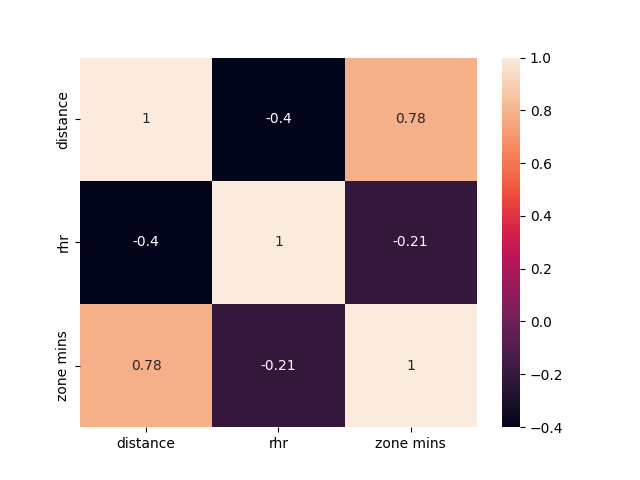
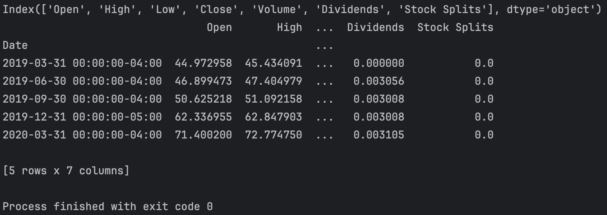
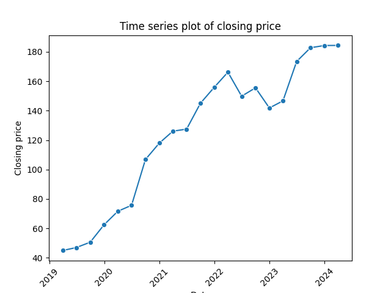
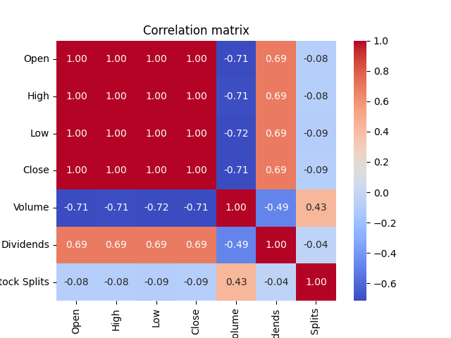
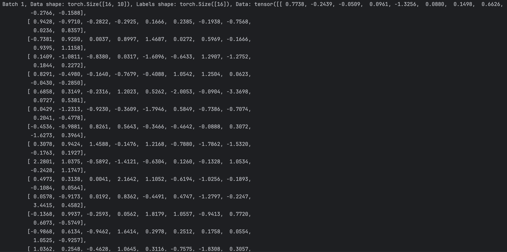

## Data Preprocessing
데이터 전처리 과정은 **레시피에 따른 요리 준비 과정**으로 볼 수 있다.
레시피를 보고 요리를 하려면 **원재료**를 적절한 형태로 준비해야한다.
예를 들어, 원재료를 씻고, 썰거나 다지고, 고기를 양념하는 것처럼 **원본 데이터**를 적절한 형태로 씻고, 썰고, 양념하는 과정이 데이터 전처리인 것이다.
이런 과정을 거쳐야만, 제대로된 요리, 즉 **모델**이 완성될 수 있다.


머신 러닝에서 데이터 전처리의 필요성을 보자.
1. **데이터 일관성**: 서로 다른 소스에서 온 데이터들은 형식이 다르거나 불완전할 수 있고, 이를 통일된 형태로 만들 수 있다.
2. **데이터 품질 향상**: 누락된 값, 이상치, 오류가 있는 데이터를 처리하여 데이터 품질을 높여 모델의 성능을 개선할 수 있다.
3. **효율적인 학습**: 데이터를 모델링에 적합한 형태로 변환하여, 학습 과정이 안정화되고 가속화될 수 있다.
4. **성능 향상**: 적절한 특성을 선택 및 변환하여 모델이 데이터의 중요한 패턴을 더 잘 학습할 수 있게 된다.

하나씩 살펴보기에 앞서, 전체적인 흐름을 살펴보고 가자.
먼저, 다양한 소스로부터 데이터를 수집한다. 이 데이터는 엑셀 데이터, 데이터베이스, 웹 크롤링, API 등 다양한 형태가 될 수 있다.
보통 이를 데이터 처리를 위한 대표적인 라이브러리인 `pandas`를 사용한다.
pandas의 `DataFrame` 형태로 데이터를 불러오고, 여기에 존재하는 이상치, 누락된 값, 오류를 처리한다.
이후, 정규화나 일반화, feature engineering 등의 과정을 거쳐 데이터를 모델링에 적합한 형태로 변환한다.
이렇게 데이터 전처리를 마친 후, 딥러닝 모델 학습에 사용하기 위해 데이터를 `Tensor`로 변환하고 모델에 입력할 수 있게 된다. 

### Data Collection
머신러닝 프로젝트의 첫 단계는 데이터 수집이다.
데이터의 수집 방법은 프로젝트의 목적과 필요한 데이터의 종류, 사용 가능한 데이터 소스에 따라 다르기 때문에
일반적으로 통용되는 데이터 수집 방법에 대해서 간단히 알아보자.

- **공개 데이터셋**
- **웹 크롤링**
- **API**
- **설문조사 및 실험**
- **합성 데이터 생성**

### Exploratory Data Analysis
데이터를 수집했으면 이 데이터에 대한 이해가 필요하다.
이를 위해 데이터의 구조, 패턴, 결측치, 이상치, 기본적인 통계 등을 시각적 및 수치적인 방법을 통해 탐색하는 과정이 탐색적 데이터 분석(EDA)라고 한다.

일반적으로, 데이터는 행과 열을 가진 표 형태로 되어있다.
각 행(row)은 데이터의 개별적인 관측치를 나타내고, 열(column)은 관측치의 특성을 나타낸다.

Kaggle에서 불러온 *Personal Exercise and Health Data*로 간단한 EDA를 해보자.

[EDA 코드 예시](./exploratory_data_analysis.py)

#### 데이터 분석에서 자주 사용되는 몇 가지 수치적 방법
- 데이터 분포 확인하기
  - **기술 통계(Descriptive Statistics)**: 데이터의 중심 경향성과 분산을 파악하기 위한 통계치로, mean, median, mode, stardard deviation, variance, min, max, quartiles 등이 있다.
  - **왜도(Skewness)**: 데이터 분포의 비대칭 정도를 측정하는 지표로, 값이 0에 가까우면 정규분포에 가까운 대칭적인 분포를, 양의 값이면 오른쪽으로 치우친 분포를, 음의 값이면 왼쪽으로 치우친 분포를 의미한다.
  - **첨도(Kurtosis)**: 데이터 분포의 뾰족한 정도와 꼬리의 두께를 나타내는 지표로, 정규분포의 첨도는 3이고 이보다 크면 뾰족하고 꼬리가 두꺼운 분포를, 작으면 더 넓게 퍼진 분포를 의미한다.
- 상관관계 분석하기
  - **상관계수(Correlation Coefficient)**: 두 변수 간의 선형적 관계의 정도를 나타내는 수치다. 일반적으로 Pearson correlation coefficient가 있으며, 이는 -1에서 1 사이의 범위를 갖고, 0은 선형 관계가 없음을 나타낸다.
  - **Spearman Rank Correlation Coefficient**: 두 변수의 순위 사이의 상관 관계를 측정하는 지표로, 변수들이 정규 분포를 따르지 않거나, 관계가 비선형일 때 유용하다.
  - **Kendall Rank Correlation Coefficient**: 두 변수의 순위 사이의 상관 관계를 측정하는 또 다른 지표로, 스피어만 상관 계수와 비슷하게 비선형 관계에도 사용할 수 있다.

#### 데이터 분석 시, 주의할 점
> 상관관계는 인과관계를 의미하지 않는다.

상관관계는 두 변수 사이의 관계의 강도와 방향만 나타낼 뿐, 한 변수의 변화가 다른 변수의 변화에 직접적인 영향을 끼치는 것을 증명하지 않는다.
또, 숨겨진 변수나 외부 요인의 영향을 받을 수 있다는 점도 주의해야 한다.



Features
- **distance**: the distance (in km) that I walked/jogged/ran basically total distance I traversed that day.
- **rhr**: resting heart rate (in bpm) for that day.
- **zone mins**: minutes of vigorous exercise for that day.

Correlation 
- **distance와 rhr**: 상관 계수가 약 -0.40으로, distance와 rhr 사이에 약간의 음의 선형 관계가 있음을 의미한다. 즉, 거리가 길어질수록 평균 심박수는 소폭 감소하는 경향을 보인다.
- **distance와 zone mins**: 상관 계수가 약 0.78로, distance와 zone mins 사이에 상당히 강한 양의 선형 관계가 있음을 의미한다. 즉, 거리가 길어질수록 특정 운동 구간에서 소요된 시간도 길어지는 경향이 있다. 이는 예상할 수 있는 결과로, 거리가 길어질수록 더 많은 시간을 운동에 할애하기 때문이다.
- **rhr와 zone mins**: 상관 계수가 약 -0.21로. 이는 rhr과 zone mins 사이에 약간의 음의 선형 관계가 있음을 의미한다. 즉, 평균 심박수가 높은 사람이 특정 운동 구간에서 소요한 시간이 소폭 감소하는 경향이 있을 수 있다. 하지만 이 관계는 상대적으로 약하기 때문에, 뚜렷한 결론을 내기에는 추가적인 분석이 필요할 수 있다.

평균 심박수(rhr)이 낮다는건, 훈련된 심장을 의미한다. 
rhr이 distance와 zone mins 간 음의 상관관계를 갖고 있다는건, rhr이 낮을수록 즉, 훈련된 심장일수록 더 많은 운동 거리와 시간을 가질 수 있다는 해석을 할 수 있다.

하지만, 단순히 상관관계로부터 끌어낸 결론이고 인과관계를 의미하는 것은 아니기 때문에
초기 가설을 세우는 데는 유용할 수 있지만, 인과관계를 확립하기 위해선 추가적인 분석이 필요하다는걸 잊어선 안되겠다.

### Data Cleaning
EDA를 통해 데이터에 대한 이해를 얻었다면, 이제 데이터를 정제하는 과정이 필요하다.
이는 레시피에서 재료를 이해한 뒤, 불필요한 부분을 제거하거나 적절한 형태로 가공하는 과정으로 이해할 수 있다.

`yfinance` 라이브러리를 사용하여 금융 데이터를 가지고 데이터 클리닝을 해보자.

크게 아래 과정을 통해 데이터를 정제할 수 있다.
1. **Data Overview**
2. **Handling Missing Values**
3. **Handling Outliers**
4. **Handling Duplicate Data**
5. Data Transformation, Feature Engineering 후 과정은 다음 섹션에서 다루도록 하겠다.
6. **Data Validation after Cleaning**

#### Data Overview
EDA를 철저히 수행했다면, 데이터에 대한 이해는 어느정도 갖춰져 있을 것이다.
이를 통해, 데이터 클리닝 작업에 필요한 인사이트를 얻을 수 있다.

- **결측치**: EDA를 통해 어떤 변수에서 결측치가 발생했는지, 그리고 그 비율이 얼마나 되는지를 파악할 수 있다. 이는 결측치 처리 전략을 세울 때 중요한 기준이 된다.
- **이상치**: 데이터의 분포를 살펴보면서 이상치를 발견할 수 있고, 이를 어떻게 처리할지 결정하는 데 도움을 준다.
- **데이터 분포**: 데이터의 분포를 확인함으로써, 정규화나 표준화 같은 스케일링 기법이 필요한지 여부를 결정할 수 있다.
- **변수 간의 관계**: 변수들 간의 상관관계를 분석하여, 불필요한 변수를 제거하거나 새로운 변수를 생성하는 feature engineering에 대한 아이디어를 얻을 수 있다.

```commandline
import yfinance as yf

# Define the stock symbol
stock = 'AAPL'

# Get data on this ticker
data = yf.Ticker(stock)

# Get the historical prices for this ticker
hist = data.history(period="5y", interval="1d").resample('QE').mean()

# Overview of the data
print(hist.head()) # First 5 rows
print(hist.columns) # Column names
print(hist.info()) # Data types and missing values
print(hist.describe()) # Summary statistics
```
##### 실행 결과


가장 간단한 주가 예측 모델을 만들기 위해, 주식의 종가(Close)만 사용하자.
```commandline
# Extract the 'Close' column
closing_price = hist['Close']
print(closing_price)

# Visualize the closing price
sns.lineplot(x=closing_price.index, y=closing_price, marker='o')
plt.title('Time series plot of closing price')
plt.xlabel('Date')
plt.ylabel('Closing price')
plt.xticks(rotation=45)
plt.show()
``` 



예측에 유용한 정보를 더할 수 있는 변수의 유무를 확인하기 위해, 변수 간 상관관계를 확인해보자.
```commandline
# Correlation matrix
sns.heatmap(hist.corr(), annot=True, fmt='.2f', cmap='coolwarm')
plt.title('Correlation matrix')
plt.show()
```


일단 학습의 목적으로 변수로 `Close`만 갖는 단순한 모델을 만들어보자.

[Data Cleaning 코드 예시](./data_cleaning.py)

#### Handling Missing Values
Overview에서 결측치의 존재 여부가 확인됐다면, 이를 처리하는 방법을 결정해야 한다.
결측치는 데이터의 불완전성을 의미하며, 모델이 편향된 결과를 내놓을 수 있고 모델 학습이 제대로 이루어지지 않을 수 있다.

결측치를 처리하는 방법은 크게 두 가지로 나뉜다.
1. **결측치 제거**: 결측치가 포함된 행이나 열을 제거하는 방법이다.
   - 결측치의 비율이 낮을 때
   - 결측치가 무작위로 발생했을 때: 결측치가 다른 특성과 관련 없이 완전히 무작위로 발생했다면 결측치를 제거해도 편향이 생길 가능성이 낮다.
   - 데이터의 양이 충분히 많을 때
2. **결측치 대체**: 결측치를 다른 값으로 대체하는 방법이다.
   - 결측치의 비율이 높을 때
   - 결측치가 특정 패턴을 따를 때: 결측치가 데이터의 다른 변수와 관련됐다면, 결측치를 대체함으로써 데이터의 원래 구조를 어느 정도 보존할 수 있다.
   - 분석의 목적: 시계열 분석을 할 때 데이터 포인트를 제거하면 시간의 연속성이 깨지거나 학습 데이터가 부족해질 수 있기 때문에, 이런 경우 대체 방법(ex. mean, median, mode 등)을 통해 결측치를 대체하는 것이 더 나을 수 있다.

```commandline
# 1. remove missing values
closing_price = closing_price.dropna(inplace=True)

# 2. impute missing values
closing_price = closing_price.fillna(closing_price.mean(), inplace=True)
```

#### Handling Outliers
이상치는 모델이 데이터의 일반적인 패턴을 학습하는 데 방해가 될 수 있다. 평균, 분산과 같은 통계량을 왜곡시켜 데이터의 전반적인 분포를 잘못 해석할 위험이 있다.
그리고, 모델이 이상치에 지나치게 적응하게 되면 일반화 능력이 떨어져 새로운 데이터에 대한 예측 성능이 떨어질 수도 있다.

그렇다고 결측치나 예상치의 무조건적인 제거는 유용한 데이터를 잃을 수 있기 떄문에, 신중히 이루어져야 한다.

이상치를 확인하는 방법은 크게 두 가지가 있다.
1. **통계적 방법**
    - **Z-score**: 데이터 포인트가 평균으로부터 얼마나 떨어져 있는지를 표준편차 단위로 나타낸다.
    - **IQR(Interquartile Range)**: 데이터의 25%-75% 사이의 범위를 사용해 이상치를 찾는다.
2. **시각적 방법**
    - **Boxplot**, **Histogram**, **Scatter plot** 등 시각화를 통해 이상치를 직관적으로 파악할 수 있다.

이상치를 처리하는 방법은 아래와 같다.
1. **Remove**: 이상치를 데이터셋에서 완전히 제거하는 방법으로, 이상치가 분석이나 모델에 심각한 영향을 미칠 때 사용되지만, 중요한 정보를 잃을 수 있다는 단점이 존재한다.
2. **Impute**: mean, median, mode 등 중심 경향성을 나타내는 값으로 대체하는 방법으로, 데이터의 손실을 줄이고 싶을 때 유용하다.
3. **Transform**: 로그 변환 같은 방법으로, 데이터 분포가 심하게 치우쳐져 있을 때 유용하다.
4. **Separate**: 이상치를 별도의 데이터셋으로 분리하고, 이상치가 아닌 데이터와 함께 분석하는 방법으로, 이상치가 특정한 패턴을 가지고 있을 때 유용하다.

#### Handling Duplicate Data
중복된 데이터는 데이터셋의 정확도와 품질을 저하시키는 요인 중 하나이다.

중복된 데이터는 추가 정보를 제공하지 않는 경우가 많아, 보통은 제거한다.
단순히 제거하기 전에, 왜 중복된 데이터가 발생했는지 원인을 파악하면 향후 비슷한 문제를 예방하거나 안전하게 제거할 수 있다.

`pandas` 라이브러리를 이용하면 쉽게 중복 데이터를 확인, 제거할 수 있다.
```commandline
# Check for duplicate data
print(closing_price.duplicated().sum())

# Remove duplicate data
closing_price = closing_price.drop_duplicates(inplace=True)
```

### Feature Engineering
위에서 요리의 재료에 대해 이해하고, 불필요한 부분을 제거했다면 이제 이를 썰고, 다듬고, 양념하는 과정을 거쳐야 한다.

Feature Engineering은 모델의 성능을 향상시키기 위해 데이터의 특성을 생성, 선택, 변환하는 과정이다.

데이터 변환 과정의 대표적인 방법은 아래와 같다.
1. **Scaling**: 가장 넓은 개념으로, 데이터의 범위를 조정하는 모든 방법을 총칭하기도 한다. 데이터 포인트 간 관계를 유지하며 데이터를 동일한 스케일로 조정하는 과정을 의미한다. 
2. **Normalization**: 데이터의 스케일을 0과 1 사이, 또는 -1과 1 사이로 조정하는 구체적인 스케일링 방법으로, 데이터가 서로 다른 단위를 갖고 있을 때 유용하다.
3. **Standardization**: 데이터의 평균을 0, 표준편차를 1로 만드는 또 다른 구체적인 스케일링 방법으로, 데이터가 정규분포를 따르지 않을 때도 사용될 수 있으며, 이상치의 영향을 줄이는 데도 유용하다.
4. **Encoding**: 범주형 데이터를 수치형 데이터로 변환하는 방법으로, 머신러닝 모델에 입력할 수 있게 한다.

#### Feature Transformation

데이터 변환의 수학적 방법을 살펴보자. 아래 방법은 연속형 데이터를 처리하는데 적합하다.
1. **Min-Max Normalization**: 데이터를 0과 1 사이의 값으로 스케일링한다.
2. **Z-점수 표준화(Standardization)**: 각 데이터 포인트에서 평균을 빼고 표준편차로 나누어, 평균이 0이고 표준편차가 1인 분포로 만든다.
3. **로그 변환**: 데이터에 자연 로그를 취해 데이터 범위를 축소시켜 큰 값들의 영향을 줄인다.
4. **제곱근 변환**: 데이터에 제곱근을 취해 이것 또한 데이터 범위를 축소시켜 큰 값들의 영향을 줄인다.
5. **박스-콕스 변환**: 데이터를 정규분포에 가깝게 만들기 위해 사용한다.

```commandline
# 1. Min-Max 정규화
def min_max_normalize(data):
    min_val = min(data)
    max_val = max(data)
    return [(x - min_val) / (max_val - min_val) for x in data]

# 2. Z-점수 표준화 (Standardization)
def standardize(data):
    mean = sum(data) / len(data)
    std_dev = (sum((x - mean) ** 2 for x in data) / len(data)) ** 0.5
    return [(x - mean) / std_dev for x in data]

# 3. 로그 변환
def log_transform(data):
    return [np.log(x) for x in data]

# 4. 제곱근 변환
def sqrt_transform(data):
    return [np.sqrt(x) for x in data]

# 5. 박스-콕스 변환 (람다 = 0.5로 가정)
def box_cox_transform(data, lmbda=0.5):
    return [(x ** lmbda - 1) / lmbda if lmbda != 0 else np.log(x) for x in data]
```

#### Encoding

범주형(Categorical) 데이터를 처리할 때 사용되는 방법은 아래와 같다. 
범주형 데이터는 텍스트 라벨이나 특정 범주나 그룹에 속하는 명확하게 구분된 값으로 이루어진 데이터를 말하고, 이런 데이터는 모델이 직접 이해하고 처리하기 어렵기 때문에 숫자 형태로 변환하는 과정이 필요하다.
1. **One-Hot Encoding**: 범주형 변수의 각 범주를 0과 1로 이루어진 벡터로 변환한다. 예를 들어, '빨강', '노랑', '파랑' 세 가지 색상이 있다면, '빨강'은 [1, 0, 0], '노랑'은 [0, 1, 0], '파랑'은 [0, 0, 1]로 표현될 수 있다.
2. **Label Encoding**: 범주형 변수의 각 변수를 유니크한 정수로 변환한다. 예를 들어, '빨강', '노랑', '파랑'을 각각 0, 1, 2와 같이 숫자로 표현할 수 있다. 하지만 이 방법은 숫자 간에 순서나 크기를 의미할 수 있어서, 모델이 잘못된 가정을 할 수 있는 단점이 있다.
3. **Binary Encoding**: 원-핫 인코딩과 비슷하지만, 각 범주를 이진 숫자로 변환한 다음 이진 수를 벡터로 표현한다. 이 방법은 범주의 수가 많을 때 원-핫 인코딩보다 효율적이다.

```commandline
def one_hot_encoding(data):
    categories = sorted(set(data)) # ['blue', 'green', 'red']
    encoded = []
    for d in data:
        encoded.append([int(d == category) for category in categories])
    return encoded

data_example = ['red', 'green', 'blue', 'red']

encoded_data = one_hot_encoding(data_example)
print(encoded_data)
```

#### Data Augmentation
데이터 증강은 데이터셋의 다양성을 증가시키거나, 더 많은 학습 데이터를 생성함으로써 모델의 성능을 향상시키는 방법이다.
- 텍스트 데이터: 동의어 교체, 문장 구조 변경, 가벼운 문법 오류 추가 등 다양성을 증가시켜 모델이 다양한 문장 구조와 표현을 이해하고, 더 일반화된 성능을 발휘할 수 있게 만든다.
- 이미지 데이터: 회전, 반전, 크롭, 색상 변경, 노이즈 추가 등의 변형을 통해 모델이 다양한 관점에서 객체를 인식하는 능력을 키우고, 과적합을 방지하는 데 도움을 준다.  
- 오디오 데이터: 속도 조정, 피치 변경, 노이즈 추가 등의 변형을 통해 모델이 더 다양한 환경에서 오디오를 인식할 수 있게 돕는다. 

[Data Transformation 코드 예시](./data_transformation.py)

### Data Splitting
데이터 분할은 모델을 훈련시키고, 검증하고, 평가하기 위해 전체 데이터셋을 여러 부분으로 나누는 과정이다.
이 과정을 통해 모델은 학습 데이터 뿐만 아니라, 새로운 데이터에 대해서도 좋은 예측 능력을 갖게 된다.

일반적으로 데이터는 다음 세 부분으로 나뉜다.
- **Training set**: 대부분의 데이터(전체 데이터 중 약 60-80%)를 훈련에 사용하는 것이 일반적이다.
- **Validation set**: 모델의 하이퍼파라미터를 조정하고 성능을 평가하는데 사용된다. 전체 데이터의 약 10-20% 정도를 할당하는 것이 일반적이다. 
- **Test set**: 모델의 성능을 최종적으로 평가하는데 사용되고 전체 데이터셋의 10-20% 정도를 할당하는 것이 일반적이다. 모델을 실제 환경에 배포하기 전에는 이 데이터 셋을 사용하지 않는 것이 중요하다.

각 데이터 셋의 비율은 데이터의 양에 따라 달라진다. 예를 들어, 수백만 개의 데이터 포인트가 있다면 훈련 데이터 셋에 98%를 할당하고, 검증/테스트 셋에 각각 1%씩 할당할 수도 있다.

> 각 데이터 셋의 유의미한 작동을 위한 최소 필요 데이터의 양이 있을까?

정확한 수치는 없지만, 일반적으로 전통적인 머신러닝 모델인 경우(ex. logistic regression, decision tree 등)에는 수백에서 수천 개의 데이터 포인트가 충분할 수 있다.
하지만, 딥러닝 모델의 경우 수천에서 수백만 개의 데이터 포인트가 필요하다.

데이터의 양이 적은 경우, Cross Validation 기법을 사용할 수 있다.
Cross Validation은 데이터를 여러 개의 fold로 나누어, 일부는 훈련에 일부는 검증에 사용하는 과정을 여러번 반복하며, 모델을 여러번 훈련시키고 검증하는 방식이다.
모든 데이터를 효율적으로 사용할 수 있어서 데이터가 적을 때 유용하다.

교차 검의 주요 유형은 다음과 같다.
- **K-Fold Cross Validation**: 데이터셋을 k개의 동일한 크기를 가진 부분집합(fold)으로 나누고, k번의 실험을 반복한다. 각 실험에서 하나의 부분집합을 검증 데이터셋으로, 나머지 k-1개의 부분집합을 훈련 데이터셋으로 사용한다. 이 과정을 모든 부분집합이 정확히 한 번씩 검증 데이터셋 역할을 하도록 k번 반복한 후, k번의 실험 결과를 평균내어 모델의 성능을 평가한다.
- **Stratified K-Fold Cross Validation**: k-겹 교차 검증과 유사하지만, 각 fold가 원본 데이터셋의 클래스 비율을 반영하도록 구성되는 방식이디. 이 방법은 특히 데이터셋에서 클래스 불균형이 있을 때 유용하다.
- **Leave-One-Out Cross Validation**: k-겹 교차 검증의 특별한 경우로, 각 실험에서 단 하나의 데이터 포인트만을 검증 데이터셋으로 사용하고, 나머지 모든 데이터를 훈련 데이터셋으로 사용해. 데이터 포인트의 총 수만큼 실험을 반복한다. 이 방법은 데이터셋이 매우 작을 때 유용하지만, 계산 비용이 매우 높을 수 있다.

### Data Feeding
머신러닝을 요리를 빗대어 이해했을 때, 재료 공수(data collection), 재료에 대한 이해(EDA), 재료 손질(data preprocessing)까지 살펴봤다.
이제 이 개별 재료를 혼합하고 소스를 넣어서 요리를 할 수 있는 상태로 만드는 과정이 필요하고, 이는 데이터를 Tensor 형태로 변환하는 과정에 해당한다.

```commandline
import torch

tensor = torch.tensor(encoded_data, dtype=torch.float32)
```
텐서로 변환한 후, 데이터의 효과적인 처리를 위해 데이터의 차원을 목적에 맞게 일치시켜주는 게 중요하다.   

차원 조정에 관련하여 핵심적인 몇 가지를 살펴보자.
1. **일관된 텐서 차원 유지**: 데이터 셋의 모든 항목이 같은 차원을 가져야 한다. 예를 들어, 이미지 데이터 셋의 경우, 모든 이미지가 같은 크기로 리사이징 되어야 한다.
2. **배치 차원 추가**: 하나의 이미지는 [height, width, channels]를 가지지만, 배치 처리를 위해선 [batch_size, height, width, channels]로 차원을 추가시켜야 한다.
3. **채널 차원 위치**: 이미지 데이터를 다룰 때, PyTorch에선 [N, C, H, W] 순서를 선호하지만 TensorFlow는 [N, H, W, C] 순서를 선호한다. 이처럼 사용하는 라이브러리에 맞게 채널 차원의 위치를 조정해야 한다.
4. **시퀀스 데이터 처리**: 시계열 데이터 같은 시퀀스 데이터를 처리할 때, 각 시퀀스의 길이를 일정한 길이로 패딩 처리하거나, 가변 길이의 시퀀스를 처리할 수 있는 방법 사용이 필요할 수 있다.
5. **데이터 타입 일치**: 입력 데이터 타입이 모델이 요구하는 데이터 타입과 일치하는지 확인해야 한다.

#### Batch Processing

대용량 데이터를 다룰 경우, 모든 데이터를 한 번에 메모리에 로드할 수 없다.
이는 학습 속도와 메모리 사용량, 모델의 성능에 영향을 미치기 때문에 데이터를 배치 단위로 로드하여 필요할 때마다 모델에 피드하는 방식을 사용하는 것이 좋다. 

```commandline
from torch.utils.data import Dataset, DataLoader

class CustomDataset(Dataset):
    def __init__(self):
        self.data = torch.randn(100, 10)
        self.labels = torch.randint(0, 2, (100,))

    def __len__(self):
        return len(self.data)

    def __getitem__(self, idx):
        return self.data[idx], self.labels[idx]

dataset = CustomDataset()

dataloader = DataLoader(dataset, batch_size=16, shuffle=True)

for batch_idx, (data, labels) in enumerate(dataloader):
    # 학습 코드
    print(f"Batch {batch_idx + 1}, Data shape: {data.shape}, Labels shape: {labels.shape}, Data: {data}, Labels: {labels}")
```

##### 코드 실행 결과


여기까지 성공적인 요리를 위해 재료를 수집하고, 이해하고, 손질하고, 양념하고, 소분하여 최종적으로 요리를 만들기까지 과정을 살펴봤다.

마지막으로 이 요리를 먹어보고, 맛을 평가하고, 필요하다면 조리법을 수정하고, 다시 요리를 만들어보는 과정을 살펴보자.

### Model Evaluation 
머신 러닝, 딥 러닝에는 다양한 문제가 존재하고, 이를 평가하기 위한 다양한 지표들이 있다.
1. **Regression**
   - 평균 제곱 오차(MSE): MSE는 낮을수록 좋다. 값이 0에 가깝다는 말은 예측값과 실제값 사이이 매우 가깝다는 걸 의미한다.  
   - 평균 절대 오차(MAE): MAE 또한 낮을수록 좋고, MSE보다 이상치에 덜 민감하다.
   - 결정 계수(R^2 score): R^2 값은 0에서 1 사이의 값을 가지며, 1에 가까울수록 모델이 데이터를 잘 설명하는 것을 의미한다.
2. **Classification**
   - 정확도(Accuracy): 정확도는 전체 예측 중 올바른 예측의 비율을 나타낸다. 높을수록 좋다.
   - 정밀도(Precision) 및 재현율(Recall): 정밀도는 모델이 True라고 예측한 것 중 실제 True인 비율을 나타내고, 재현율은 실제 True 중 모델이 True라고 예측한 비율을 나타낸다. 둘 다 높을수록 좋다.
   - F1 점수: 정밀도와 재현율의 조화 평균으로 둘 사이의 균형을 나타내고, 1에 가까울수록 좋다.
   - ROC-AUC: ROC 곡선 아래 영역으로, 1에 가까울수록 좋다.
3. **Natural Language Processing**
   - BLEU 점수: 기계 번역의 품질을 평가하며, 0에서 1사이의 값을 가지고 1에 가까울수록 좋다.
   - 정확도, F1 점수: 텍스트 분류 문제
   - perplexity: 언어 모델의 성능
4. **Convoluational Neural Network**
    - 정확도(Accuracy): 이미지 분류 문제
    - 정밀도, 재현율, F1 점수: 객체 탐지 문제
    - IoU(Intersection over Union): 이미지 분할 문제에서 사용되며, 예측된 영역과 실제 영역의 겹치는 부분의 비율을 나타내 높을수록 좋다고 판단한다.

배운 내용을 바탕으로, 실제 데이터셋을 사용하여 회귀 문제를 해결하는 실습으로 넘어가보자.
실제 데이터를 바탕으로 모델을 학습시키고, 평가하는 과정에서 수많은 문제가 발생할 수 있다.
이를 해결하는 과정에서 더 많은 학습과 성장이 이루어질 것이다.

> 도전이 어려울수록 보상도 커진다.

