# Regression

찬은 프리랜서 데이터 사이언티스트로 일하고 있다. 
단순한 데이터 사이언티스트일 뿐만 아니라, 새로운 AI 기술에 끝없이 적응하며 학습하는 개방적이고 호기심이 많은, 자유로운 영혼을 가진 사람이다.
늦은 아침, 여유롭게 잠에서 일어난 찬은 전날의 프로젝트를 마무리하고, 그 프로젝트를 기반으로 회사의 주가를 예측하는 모델을 만들기로 결정한다. 

어떤 기업을 고를지 고민하던 찬은 단순히 시가총액을 기준으로 1위 기업인 Microsoft의 주식 데이터를 이용하기로 한다.
```commandline
import yfinance as yf

msft = yf.Ticker("MSFT")

# get all stock info
for key, value in msft.info.items():
    print(key, ":", value)
```

info 데이터를 살펴본 찬은 과거 5년간의 주식 데이터를 가져오기로 결정한다.
일별 또는 주별 데이터는 높은 변동성과 노이즈를 포함하고 있기 때문에 분기별 데이터로 정규화하여 더 안정적인 추세를 관찰하기로 한다.

```commandline
# get historical price
hist = msft.history(period="5y", interval="1d").resample("QE").mean()
```

찬은 분기별로 정규화된 데이터를 바라보며 "이 데이터만으로 충분할까?"라는 의문이 들었지만, 객체지향 원칙에 따라 가장 단순한 모델을 만들기로 결정한다.
그렇게 여러 columns 중 `Close`만을 사용한다.

그렇게 불러온 데이터가 올바르게 정리됐는지 데이터 타입, 결측치, 이상치를 확인한다.

##### Boxplot

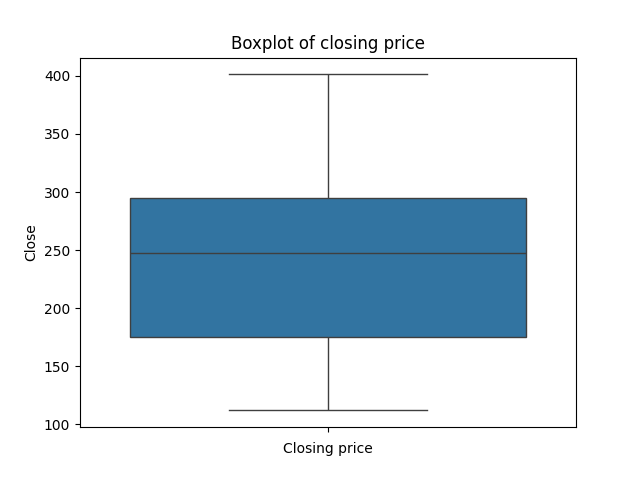
데이터 타입은 float이며, 결측치는 없다.
mean 값(239.95)이 median 값(247.92)이 크게 차이나지 않는 것으로 보아 이상치의 영향이 크지 않다.
박스 위아래로 그려진 수염은 데이터의 최대값과 최소값을 나타내는데, 이걸 통해서도 이상치가 없다는 걸 확인할 수 있다.

##### Histogram
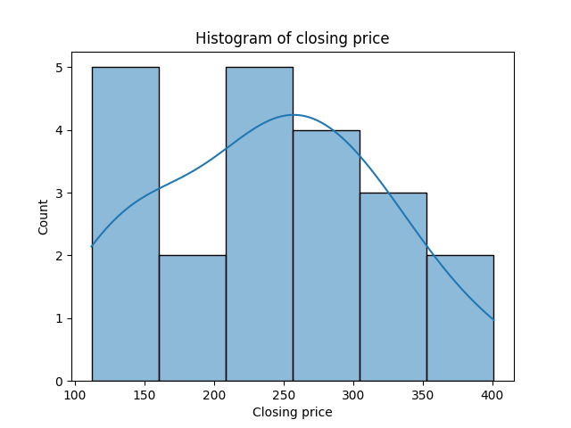
분포는 대체적으로 종 모양을 띄고 있지만, 오른쪽으로 긴 꼬리를 갖고 있다.

두 개의 그래프를 통해 주가 데이터가 다소 넓은 범위로 분포되어 있지만 특정 구간에 몰려있는 것과 이상치가 없다는 것을 확인할 수 있었다.

------------------------------------------------------------------------------------------------------------------------


데이터가 올바르게 정리됐다는 것을 확인한 찬은 이제 모델을 만들기로 한다.
시작 단계로 시간을 독립 변수로 `Close` 가격을 종속 변수로 설정한 단순한 선형 회귀 모델을 선택한다.

하나의 주가 데이터를 가지고 학습시키면 예측에 대한 일반화가 어려울 수 있기 때문에 여러 기업의 주가 데이터를 가지고 학습시키는 것이 좋다는 것을 알게 된 찬은,
위에서 사용한 코드를 여러 기업의 주가 데이터를 가지고 학습시킬 수 있도록 수정한다.

```commandline
tickers = ["MSFT", "AAPL", "NVDA", "GOOG", "AMZN", "META", "TSM", "AVGO", "NVO", "TSLA"]

closing_prices = pd.DataFrame()

for ticker in tickers:
    stock = yf.Ticker(ticker)
    hist = stock.history(period="5y", interval="1d").resample("QE").mean()
    closing_price = hist["Close"]

    closing_prices[ticker] = closing_price

# Overview of the data
print(closing_prices.info())  # check for missing values and data types
print(closing_prices.describe())  # check for outliers

for stock in closing_prices.columns:
    sns.boxplot(closing_prices[stock])
    plt.title(f'Boxplot of closing price for {stock}')
    plt.xlabel('Closing price')
    plt.show()

    sns.histplot(closing_prices[stock], kde=True)
    plt.title(f'Histogram of closing price for {stock}')
    plt.xlabel('Closing price')
    plt.show()
```

모델을 정의하기 전에 데이터 분할이 필요하다. 찬은 80%의 데이터를 학습 데이터로, 10%의 데이터를 검증 데이터로, 나머지 10%의 데이터를 테스트 데이터로 나누기로 한다.
시계열 데이터는 순서가 중요하기 때문에 무작위로 데이터를 섞지 않고 순서대로 나누기로 한다.

데이터셋의 크기가 작을 경우, 교차검증을 고려해볼 수 있지만 찬은 학습의 단순화를 위해서 보류하기로 한다.

```commandline
# Data splitting
train_ratio = 0.8
validation_ratio = 0.1
test_ratio = 0.1

# 각 세트에 할당할 데이터 포인트의 수 계산
total_points = closing_prices.shape[0]
train_points = int(total_points * train_ratio)
validation_points = int(total_points * validation_ratio)
test_points = total_points - train_points - validation_points

# 데이터 순서대로 분할
train_data = closing_prices[:train_points]
validation_data = closing_prices[train_points:train_points+validation_points]
test_data = closing_prices[train_points+validation_points:]
```

이제 모델을 정의할 차례이다. 찬은 단순한 선형 회귀 모델을 사용하기로 했다.
지금은 closing price만을 사용한 단순한 데이터 셋을 사용하지만, 추후 financial data를 추가할 계획이 있기 때문에 확장 가능한 모델을 만들기로 한다.

회귀 모델을 사용할 때, 모델에 feed할 데이터 X와 학습의 기준이 될 타겟 y를 정의해야 하는데 
주가 예측 예시에선 예측해야할 y가 있을 뿐 타겟 y가 없다. 따라서, 데이터 내부에서 y를 생성해야 한다.
이때, 가장 일반적인 방법은 시간 차이(time lag)을 사용하는 것이다. 

시간 차이를 사용하여 Y를 설정하는 방법은 다음과 같다.
1. **직접 예측 방식**: t시점을 직접 지정하고 t+1시점을 예측하는 방식. 예를 들어, 어제의 주가를 가지고 내일의 주가를 예측하고자 한다면, 어제의 주가를 X로 사용하고 내일의 주가를 Y로 사용하는 것이다.
2. **Moving window 방식**: 과거 N일의 데이터를 가지고 N+1일의 데이터를 예측하는 방식.

분기별 데이터는 그 자체로 moving window가 되어있기 때문에 찬은 직접 예측 방식을 사용하기로 한다.
위에서 단순히 closing prices 데이터프레임을 분할했지만, 이제 시간 차이를 이용한 X와 Y를 나누었기 때문에 그에 맞게 데이터를 다시 분할한다.

```commandline
# Define the input X and target Y using time lagged data
X = closing_prices.iloc[:-1]
Y = closing_prices.iloc[1:]

# Data splitting
train_X = X[:train_points]
train_Y = Y[:train_points]

validation_X = X[train_points:train_points + validation_points]
validation_Y = Y[train_points:train_points + validation_points]

test_X = X[train_points + validation_points:]
test_Y = Y[train_points + validation_points:]
```

분할을 마쳤다면 모델이 소화할 수 있는 형태인 Tensor로 변환해야 한다.

```commandline
# 데이터를 PyTorch 텐서로 변환
train_X = torch.tensor(train_X.values, dtype=torch.float32)
train_Y = torch.tensor(train_Y.values, dtype=torch.float32)

validation_X = torch.tensor(validation_X.values, dtype=torch.float32)
validation_Y = torch.tensor(validation_Y.values, dtype=torch.float32)

test_X = torch.tensor(test_X.values, dtype=torch.float32)
test_Y = torch.tensor(test_Y.values, dtype=torch.float32)
```

이제 모델을 정의한다.

```commandline
class Predictor(nn.Module):
    def __init__(self, input_dim, hidden_dim, output_dim):
        super(Predictor, self).__init__()
        self.fc1 = nn.Linear(input_dim, hidden_dim)
        self.relu = nn.ReLU()
        self.fc2 = nn.Linear(hidden_dim, output_dim)

    def forward(self, x):
        out = self.fc1(x)
        out = self.relu(out)
        out = self.fc2(out)
        return out
```

학습에 사용할 하이퍼파라미터를 정의하고, 모델을 초기화 한 뒤 손실 함수와 옵티마이저 정의까지 마친 찬은, 이제 학습을 시작한다.

```commandline
# 학습 파라미터 설정
epochs = 1000
learning_rate = 0.001
input_dim = len(tickers)
hidden_dim = 100
output_dim = len(tickers)

# 모델 생성
predictor = Predictor(input_dim=input_dim, hidden_dim=hidden_dim, output_dim=output_dim)

# 손실 함수와 옵티마이저 정의
criterion = nn.MSELoss()
optimizer = optim.Adam(predictor.parameters(), lr=learning_rate)

# 학습
for epoch in range(epochs):
    optimizer.zero_grad()
    output = predictor(train_X)
    loss = criterion(output, train_Y)
    loss.backward()
    optimizer.step()

    if epoch % 100 == 0:
        print(f'Epoch {epoch} Loss: {loss.item()}')
```

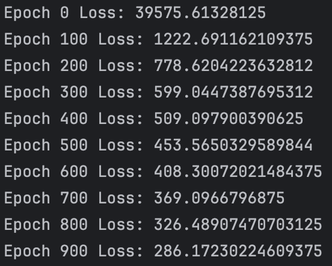

학습이 진행되는 동안 손실이 줄어드는 것을 확인한 찬은 학습이 끝난 모델을 검증 데이터에 적용해본다.

```commandline
# 모델 평가
with torch.no_grad():
    validation_output = predictor(validation_X)
    validation_loss = criterion(validation_output, validation_Y)
    print(f"Validation Loss: {validation_loss.item()}")
```

결과는 *5431.44140625*로, 학습 데이터에 대한 손실보다 훨씬 높은 값이 나왔다. 이는 모델이 학습 데이터에 과적합되었거나, 모델이 너무 단순하다는 것을 의미한다.

다음과 같은 방안을 고려해볼 수 있다.
1. **모델 복잡도 증가**: 더 많은 은닉층을 추가하여 더 복잡한 패턴을 학습할 수 있도록 한다.
2. **은닉 유닛수 증가**: 때로는 더 많은 뉴런이 더 많은 정보를 학습할 수 있도록 한다.
3. **정규화 기법 사용**: L1, L2 정규화 또는 드롭아웃을 사용하여 과적합을 방지한다.
4. **하이퍼파라미터 조정**: learning rate가 너무 높거나 낮은 경우, 학습의 효율이 떨어질 수 있다.
5. **배치 정규화**: 각 레이어의 입력을 정규화하여 학습을 안정화시킨다.
6. **더 많은 데이터**: 더 많은 데이터를 사용하여 모델이 더 일반화되도록 한다.

찬은 은닉층을 추가해 모델의 복잡도를 높이기로 결정한다.

```commandline
class Predictor(nn.Module):
    def __init__(self, input_dim, hidden_dim1, hidden_dim2 output_dim):
        super(Predictor, self).__init__()
        self.fc1 = nn.Linear(input_dim, hidden_dim1)
        self.relu = nn.ReLU()
        self.fc2 = nn.Linear(hidden_dim1, hidden_dim2)
        self.relu = nn.ReLU()
        self.fc3 = nn.Linear(hidden_dim2, output_dim)

    def forward(self, x):
        out = self.fc1(x)
        out = self.relu(out)
        out = self.fc2(out)
        out = self.relu(out)
        out = self.fc3(out)
        return out
```

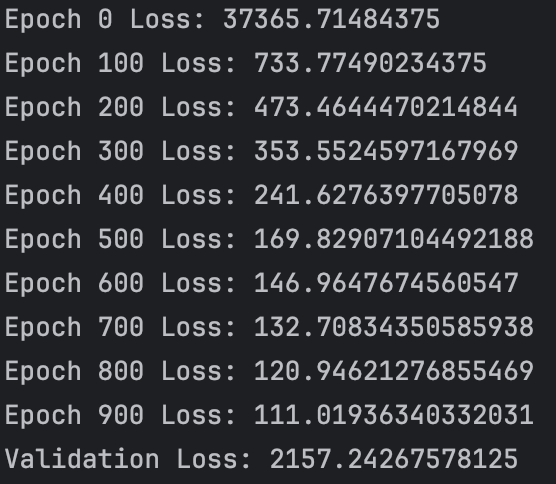

모델의 복잡도를 높인 결과, 손실이 줄어든 것을 확인할 수 있었다.
하지만, 여전히 검증 데이터에 대한 손실이 높은 것을 확인한 찬은 다른 옵션도 하나씩 시도해보기로 한다.

##### Hidden layer + Dropout(0.5) 적용
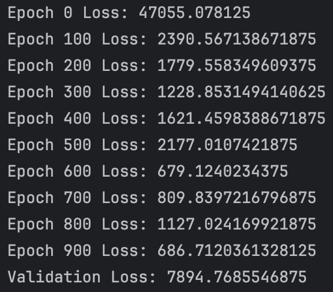

##### Hidden layer + Dropout(0.3) 적용
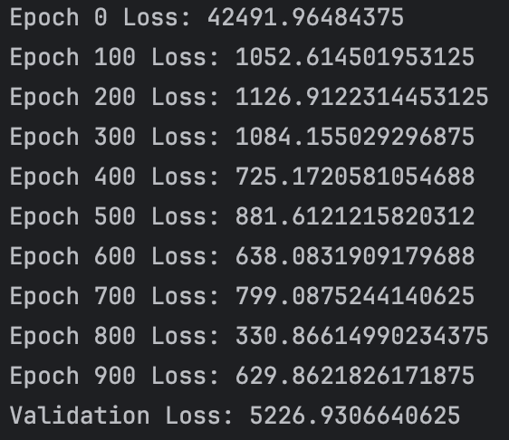

##### Hidden layer + L1 Batch Normalization 적용


##### Hidden layer + Dropout(0.5) + L1 Batch Normalization 적용
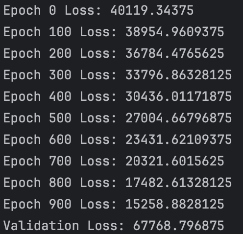

##### Hidden layer + Dropout(0.3) + L1 Batch Normalization 적용


찬은 몇가지 방법을 시도해본 결과, 단순히 은닉층 추가만 한 경우가 가장 손실이 낮게 나온다는 것을 확인했다.
하지만, 여전히 검증 손실이 높아 모델을 수정하는 방법 외에 다른 방법을 시도해보기로 한다.

##### Learning rate 조정 (0.001 -> 0.01)
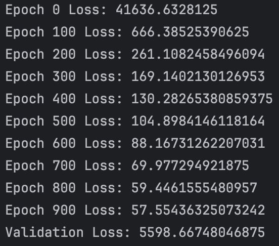

##### Optimizer 변경 (Adam -> SGD)
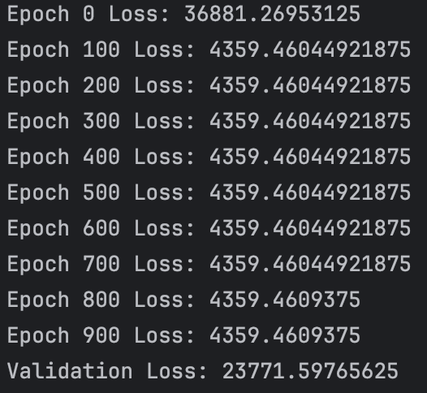

##### Early stopping 적용
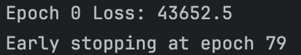

단순히 은닉층을 추가한 경우가 훈련 손실과 검증 손실 간 차이를 고려한다면 가장 나은 결과를 보였다.
과도한 조정이나 복잡도 증가는 오히려 모델의 성능을 저하시킬 수 있다는 것을 보여준다.

또한, 모든 모델과 데이터셋에는 성능 한계가 존재하며, 모델 성능을 단순히 현재의 검증 손실 수치로만 판단하지 않고,
모델이 해결하고자 하는 문제에 대해 얼마나 잘 대응하는지를 종합적으로 평가하는 것이 중요하다는 점도 중요하다.

검증 데이터의 평가까지 마친 찬은 이제 테스트 데이터를 사용해 모델의 성능을 최종적으로 평가하기로 한다.

```commandline
with torch.no_grad():
    test_output = predictor(test_X)
    test_loss = criterion(test_output, test_Y)
    print(f"Test Loss: {test_loss.item()}")
```

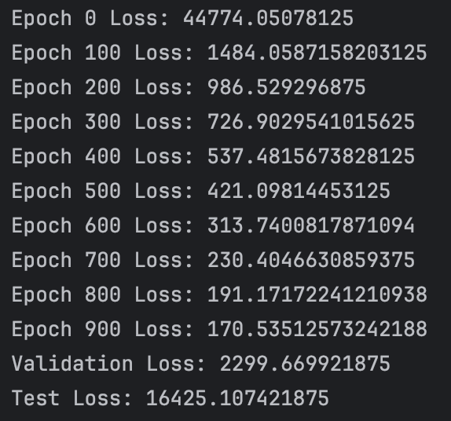

테스트 평가까지 마친 찬은 이제 모델에 새로운 데이터를 넣어 예측을 해보기로 한다.   

```commandline
# Load the new data for prediction
new_close = pd.DataFrame()

new_tickers = ["ASML",]
for ticker in new_tickers:
    stock = yf.Ticker(ticker)
    hist = stock.history(period="10y", interval="1d").resample("QE").mean()
    closing_price = hist["Close"]

    new_close[ticker] = closing_price
```

불러온 새로운 데이터 또한 기존 데이터와 동일한 전처리 과정을 거쳐야한다.
코드의 중복을 줄이기 위해 전처리 과정을 함수로 만들어 사용하기로 한다.

```commandline
def preprocess(data):
    # Define the input X and target Y using time lagged data
    X = data.iloc[:-1]
    Y = data.iloc[1:]

    # Data splitting
    train_ratio = 0.8
    validation_ratio = 0.1
    test_ratio = 0.1

    # 각 세트에 할당할 데이터 포인트의 수 계산
    total_points = data.shape[0]
    train_points = int(total_points * train_ratio)
    validation_points = int(total_points * validation_ratio)
    test_points = total_points - train_points - validation_points

    # 데이터 순서대로 분할
    train_X = X[:train_points]
    train_Y = Y[:train_points]

    validation_X = X[train_points:train_points + validation_points]
    validation_Y = Y[train_points:train_points + validation_points]

    test_X = X[train_points + validation_points:]
    test_Y = Y[train_points + validation_points:]

    # 데이터를 PyTorch 텐서로 변환
    train_X = torch.tensor(train_X.values, dtype=torch.float32)
    train_Y = torch.tensor(train_Y.values, dtype=torch.float32)

    validation_X = torch.tensor(validation_X.values, dtype=torch.float32)
    validation_Y = torch.tensor(validation_Y.values, dtype=torch.float32)

    test_X = torch.tensor(test_X.values, dtype=torch.float32)
    test_Y = torch.tensor(test_Y.values, dtype=torch.float32)

    return train_X, train_Y, validation_X, validation_Y, test_X, test_Y
```

새로운 데이터의 shape은 (41, 1)로 기존 데이터의 shape (41, 10)과 다르다.
그대로 모델에 입력으로 넣게 되면 행렬 연산에서 차원에 대한 에러가 발생하기 때문에, 찬은 새로운 데이터를 기존 데이터와 동일한 shape으로 변환하기로 한다.

```commandline
# new_train_X의 형태를 조정
predict_X = torch.zeros(new_train_X.size(0), 10)  # 10개의 특성을 가진 새로운 텐서 생성
predict_X[:, 0] = new_train_X.squeeze()  # 첫 번째 특성에만 원래 데이터를 넣고 나머지는 0으로 남김
```

찬은 이제 모델에 새로운 데이터를 넣어 예측을 해보기로 한다.
```commandline
# 새로운 데이터에 대한 예측
predictor.eval()
with torch.no_grad():
    prediction = predictor(predict_X)

    print(f"New data prediction: {prediction[:, 0]}")
```

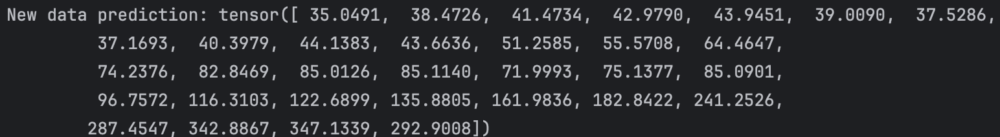

ASML의 실제 주가와 예측한 주가를 비교해본 찬은 모델의 예측 정확도에 다소 실망했지만,
이번 프로젝트를 통해 처음부터 끝까지 모델을 만들어보는 과정만으로도 많은 것을 배울 수 있었다고 생각한다.

찬은 이러한 인공지능과의 상호작용이 불러올 미래의 변화를 상상하며 미래에 대한 두려움이 아닌 호기심을 가지고 더 많은 프로젝트를 진행해보기로 한다.


------------------------------------------------------------------------------------------------------------------------
# Multi linear regression
찬은 close price만을 사용한 단순한 선형 회귀 모델을 사용했지만, 이번에는 financial data를 추가하여 multi linear regression을 사용해보기로 한다.

회사는 전처럼 tech industry의 top 10 기업을 사용하고, financial data를 추가하기로 한다.
특성으로 사용할 financial data와 불러올 코드는 이 모든 프로젝트의 벤치마크이자 찬의 롤모델인 [대두족장님 깃헙](https://github.com/neobundy/Deep-Dive-Into-AI-With-MLX-PyTorch.git)의 코드를 참고했다.

### Data Collection

```commandline
for ticker in tickers:
    stock = yf.Ticker(ticker)

    # Fetch 10 years of historical data
    hist = stock.history(period="10y", interval="1d").resample("QE").mean()

    # Get current info
    info = stock.info
    selected_info = {
        'CurrentPrice': info.get('currentPrice'),
        'MarketCap': info.get('marketCap'),
        'BookValue': info.get('bookValue'),
        'ProfitMargins': info.get('profitMargins'),
        'EarningsGrowth': info.get('earningsGrowth'),
        'RevenueGrowth': info.get('revenueGrowth'),
        'ReturnOnEquity': info.get('returnOnEquity'),
        'ForwardEPS': info.get('forwardEps'),
        'TrailingEPS': info.get('trailingEps'),
        'ForwardPE': info.get('forwardPE'),
        'TrailingPE': info.get('trailingPE'),
        'FreeCashflow': info.get('freeCashflow')
    }

    # Repeat the info data for each date in the historical data
    for key, value in selected_info.items():
        hist[key] = value

    # Add a column for the ticker symbol
    hist['Ticker'] = ticker

    # Use pd.concat to append this data to the main DataFrame
    historical_data = pd.concat([historical_data, hist], ignore_index=True)

# Reset the index of the DataFrame
historical_data.reset_index(inplace=True, drop=True)
```

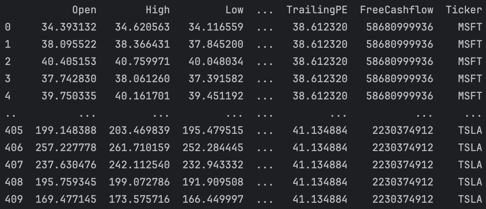

dataframe을 만든 찬은 앞으로 할 일을 요리에 빗대어 되짚어보기로 한다.
1. 요리 재료의 공수: 데이터 수집
2. 재료의 상태 확인: 데이터 탐색(Exploratory Data Analysis; EDA)
3. 재료의 가공: 데이터 전처리
4. 요리법: 모델링
5. 요리: 학습
6. 맛보기 후 조정: 평가 후 수정

### Exploratory Data Analysis

데이터 수집을 마친 찬은 데이터 타입 확인, 결측치, 분포 확인 같은 기본적인 데이터 탐색을 시작한다.

```commandline
# Display the DataFrame
print(historical_data)

# Check for missing values and data types
print(historical_data.info())
```

하지만, 각 열 내엔 여러 기업의 데이터가 섞여있어서 의미 있는 결과가 나오지 않을 것이라 예상한 찬은 각 기업별로 데이터를 분리하여 탐색하기로 한다.

```commandline
grouped = historical_data.groupby('Ticker')
for name, group in grouped:
    print(f"The {name}'s summary statistics: {group.describe()}") # Display summary statistics for each group
    
    # Plot boxplots for each column in the group
    for column in group.columns:
        sns.boxplot(data=group[column])
        plt.title(f"{name}: {column}")
        plt.show()
```

이렇게 모든 열에 대한 boxplot을 진행했지만, 열 중에는 Stock Splits 같은 연속형 데이터가 아닌 이벤트성 데이터가 섞여있기도 하고 
Close와 CurrentPrice 같은 중복된 데이터도 있어서 필요한 데이터만 가지고 따로 리스트를 만들어 거기에 대해서만 시각화를 하기로 한다.

```commandline
continuous_columns = [
    'Close', 'Volume',
    'BookValue', 'ProfitMargins',
    'EarningsGrowth', 'RevenueGrowth', 'ReturnOnEquity',
    'ForwardEPS', 'TrailingEPS', 'ForwardPE', 'TrailingPE', 'FreeCashflow'
]

...
    # Plot boxplots for each column in the group
    for column in group.columns:
        if column in continuous_columns:  # 수정
            sns.boxplot(data=group[column])
            plt.title(f"{name}: {column}")
            plt.show()
```

시각화 결과, 가격 데이터와 거래량 데이터를 제외한 나머지 값들은 최신의 하나의 값으로 과거 데이터가 전부 대체되어 있었다. 
이는 해당 데이터가 시계열 데이터가 아니라 단순히 최신 값으로만 기록되어 있기 때문에, 시간에 따른 변화를 분석하는 것이 불가능했다. 
따라서, 이러한 변수들을 사용한 시계열 분석은 의미가 없다는 결론을 내렸다. 
찬은 EDA의 방법을 학습한 것이니, 이 경험에 만족하고 다음 과정인 데이터 전처리로 넘어가기로 한다.

### Data Preprocessing
close price 하나만을 사용한 단순한 선형 회귀 모델과 달리, financial data를 추가한 multi linear regression을 사용하기로 한 찬은 데이터의 단위를 맞추기 위한 데이터 변환의 필요성을 생각한다.

데이터 변환엔 주로 정규화와 표준화 방법이 사용된다.
다중 선형 회귀 모델에서는 표준화가 더 권장되곤 한다. 이유는 표준화가 특성 간에 상대적인 스케일을 보존하기 떄문이다.

전체 데이터에 대한 표준화를 진행한 뒤 train/validation/test 데이터로 분할시키려 했지만
이 방식은 메모리 누수를 일으킬 수 있으며, 모델이 훈련 과정에서 테스트 데이터에 대한 정보를 미리 얻게 되어 실제 성능보다 과대평가 되는 결과를 가져올 수 있다는 것을 알게된 찬은
데이터를 분할한 뒤 각 데이터셋에 대해 표준화를 진행하기로 한다.

데이터 분할 후 표준화를 진행하고, 이를 텐서로 변환시키는 과정에서 데이터셋의 마지막 열인 `Ticker`가
에러를 일으켜 데이터셋에서 제외시키기로 한다.

```commandline
from sklearn.preprocessing import StandardScaler

def preprocess(data):
    # Split the data into numerical and ticker features
    numerical_data = data.iloc[:, :-1]

    # Define the input X and target Y using time lagged data
    X = numerical_data.iloc[:-1]
    Y = numerical_data.iloc[1:]

    # Set ratio for train, validation, and test sets
    train_ratio = 0.7
    validation_ratio = 0.2
    test_ratio = 0.1

    # Calculate the number of points for each set
    total_points = X.shape[0]
    train_points = int(total_points * train_ratio)
    validation_points = int(total_points * validation_ratio)
    test_points = total_points - train_points - validation_points

    # Split the data sequentially
    train_X = X[:train_points]
    validation_X = X[train_points:train_points + validation_points]
    test_X = X[train_points + validation_points:]

    train_Y = Y[:train_points]
    validation_Y = Y[train_points:train_points + validation_points]
    test_Y = Y[train_points + validation_points:]

    # Initialize the StandardScaler
    scaler_X = StandardScaler()
    scaler_Y = StandardScaler()

    # Standardize the data
    train_X = scaler_X.fit_transform(train_X)
    validation_X = scaler_X.transform(validation_X)
    test_X = scaler_X.transform(test_X)

    train_Y = scaler_Y.fit_transform(train_Y)
    validation_Y = scaler_Y.transform(validation_Y)
    test_Y = scaler_Y.transform(test_Y)

    # Convert the DataFrames to PyTorch tensors
    train_X = torch.tensor(train_X, dtype=torch.float32)
    validation_X = torch.tensor(validation_X, dtype=torch.float32)
    test_X = torch.tensor(test_X, dtype=torch.float32)

    train_Y = torch.tensor(train_Y, dtype=torch.float32)
    validation_Y = torch.tensor(validation_Y, dtype=torch.float32)
    test_Y = torch.tensor(test_Y, dtype=torch.float32)

    return train_X, validation_X, test_X, train_Y, validation_Y, test_Y
```

이렇게 데이터 전처리를 마친 찬은 모델링을 시작하기로 한다.
단일 선형 회귀 모델에서 확장 가능하도록 정의해놓았기 때문에 모델을 그대로 사용하기로 한다.

```commandline
from predictor import Predictor

# Define hyperparameters
input_dim = train_X.shape[1]
hidden_dim1 = 128
hidden_dim2 = 64
output_dim = 1
learning_rate = 0.001
epochs = 5000
patience = 10
best_loss = float('inf')
counter = 0

# Initialize the model
predi = Predictor(input_dim, hidden_dim1, hidden_dim2, output_dim)

# Define the loss function and optimizer
criterion = torch.nn.MSELoss()
optimizer = torch.optim.Adam(predi.parameters(), lr=learning_rate)

# Train the model
for epoch in range(epochs):
    # Set the model to training mode
    predi.train()
    
    # Forward pass
    outputs = predi(train_X)
    loss = criterion(outputs, train_Y)

    # Backward pass and optimization
    optimizer.zero_grad()
    loss.backward()
    optimizer.step()
    
    # Set the model to evaluation mode
    predi.eval()

    # Validation loss
    with torch.no_grad():
        validation_output = predi(validation_X)
        validation_loss = criterion(validation_output, validation_Y)
        
   # Early stopping
    if validation_loss.item() < best_loss:
        best_loss = validation_loss.item()
        counter = 0
    else:
        counter += 1
        
    if counter >= patience:
        print(f"Stopped at epoch {epoch} with validation loss {validation_loss.item()}")
        break

    if epoch % 100 == 0:
        print(f"Epoch: {epoch}, Loss: {loss.item():.4f}, Validation Loss: {validation_loss.item():.4f}")
        
    predi.train() # Set the model back to training mode
        
# Test the model
with torch.no_grad():
    test_output = predi(test_X)
    test_loss = criterion(test_output, test_Y)
    print(f"Test Loss: {test_loss.item():.4f}")
```

모델 학습을 마친 찬은 이제 새로운 데이터를 불러와서 예측을 해보기로 한다.
yfinance에서 데이터를 fetch 해오는 과정이 새로운 데이터를 불러올 때도 중복되기 때문에, 이를 함수로 만들어 재사용할 수 있게 코드를 수정한다.

```commandline
def fetch_stock_data(tickers):
    # Initialize an empty DataFrame for historical data
    historical_data = pd.DataFrame()

    for ticker in tickers:
        stock = yf.Ticker(ticker)

        # Fetch 10 years of historical data
        hist = stock.history(period="10y")

        # Get current info
        info = stock.info
        selected_info = {
            'CurrentPrice': info.get('currentPrice'),
            'MarketCap': info.get('marketCap'),
            'BookValue': info.get('bookValue'),
            'ProfitMargins': info.get('profitMargins'),
            'EarningsGrowth': info.get('earningsGrowth'),
            'RevenueGrowth': info.get('revenueGrowth'),
            'ReturnOnEquity': info.get('returnOnEquity'),
            'ForwardEPS': info.get('forwardEps'),
            'TrailingEPS': info.get('trailingEps'),
            'ForwardPE': info.get('forwardPE'),
            'TrailingPE': info.get('trailingPE'),
            'FreeCashflow': info.get('freeCashflow')
        }

        # Repeat the info data for each date in the historical data
        for key, value in selected_info.items():
            hist[key] = value

        # Add a column for the ticker symbol
        hist['Ticker'] = ticker

        # Use pd.concat to append this data to the main DataFrame
        historical_data = pd.concat([historical_data, hist], ignore_index=True)

    # Reset the index of the DataFrame
    historical_data.reset_index(inplace=True, drop=True)

    return historical_data

historical_data = fetch_stock_data(tickers)
new_data = fetch_stock_data(["NFLX"]) # Fetch new data
```

새로운 데이터(Netflix)를 불러온 찬은 모델에 적용하기 전에 데이터 전처리를 진행한다.
모델의 예측을 수행한 결과 값이 표준화된 값인걸 확인한 찬은 이를 다시 역변환하는 과정이 필요하다는 것을 알게된다.
그걸 위해선 표준화를 진행할 때 사용한 scaler가 필요해서 함수 외부에서 선언해주기로 한다.

```commandline
# Initialize the StandardScaler
scaler_X = StandardScaler()
scaler_Y = StandardScaler()

def preprocess(data, scaler_X, scaler_Y):
    ...
    
    return train_X, validation_X, test_X, train_Y, validation_Y, test_Y
    
# Make predictions
new_data = fetch_stock_data(["NFLX"]) # Fetch new data
new_train_X, _, _, _, _, _ = preprocess(new_data, scaler_X, scaler_Y) # Preprocess the new data

predi.eval()
with torch.no_grad():
    new_prediction = predi(new_train_X) # Make predictions
    prediction_numpy = new_prediction.numpy() # Convert the tensor to a NumPy array
    prediction_actual = scaler_Y.inverse_transform(prediction_numpy) # Inverse transform the predictions

    print(f"New data prediction: {prediction_actual}")
```

텐서에서 numpy로, 표준화된 값에서 역변환된 값으로 변환을 진행하는 중에 에러가 발생한다.

> ValueError: non-broadcastable output operand with shape (1761,1) doesn't match the broadcast shape (1761,19)

이 에러는 preprocess 함수 내의 scaler가 19개의 특성을 가진 데이터에 대해 fit_transform을 진행했기 때문에, 역변환 시에도 19개의 특성을 가진 데이터에 대해 inverse_transform을 진행해야 한다는 것을 알려주는 에러이다.
예측까지 진행한 데이터셋이 하나의 차원을 갖는건 문제가 없으니, 찬은 preprocess 함수 내에서 데이터를 재정의한다.

```commandline
def preprocess(data, scaler_X, scaler_Y):
    # Split the data into numerical and ticker features
    numerical_data = data.iloc[:, :-1]

    # Define the input X and target Y using time lagged data
    X = numerical_data.iloc[:-1]
    Y = numerical_data['Close'].iloc[1:].values.reshape(-1, 1)
    
    ...
    
    return train_X, validation_X, test_X, train_Y, validation_Y, test_Y
```

이렇게 데이터 재정의와 함께 역변환까지 진행한 찬은 이제 모델의 예측을 확인해본다.

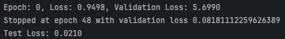
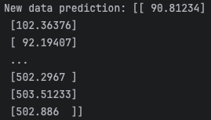

단일 선형 회귀 모델이 예측한 결과보다 훨씬 더 정확한 예측을 보여준 predi에게 찬은 깊은 감명을 받았다.
찬은 predi와 함께 더 나아질 내일을 기대하며, 묵묵히 한걸음씩 나아가기로 한다.

