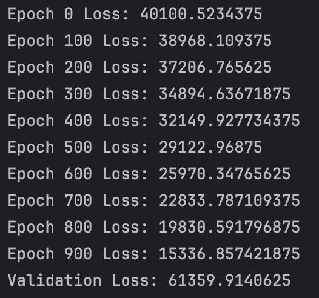
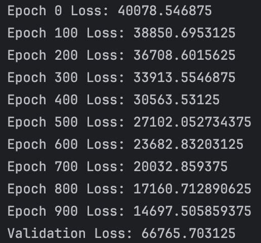

## Regression

찬은 프리랜서 데이터 사이언티스트로 일하고 있다. 
단순한 데이터 사이언티스트일 뿐만 아니라, 새로운 AI 기술에 끝없이 적응하며 학습하는 개방적이고 호기심이 많은, 자유로운 영혼을 가진 사람이다.
늦은 아침, 여유롭게 잠에서 일어난 찬은 전날의 프로젝트를 마무리하고, 그 프로젝트를 기반으로 회사의 주가를 예측하는 모델을 만들기로 결정한다. 

어떤 기업을 고를지 고민하던 찬은 단순히 시가총액을 기준으로 1위 기업인 Microsoft의 주식 데이터를 이용하기로 한다.
```commandline
import yfinance as yf

msft = yf.Ticker("MSFT")

# get all stock info
for key, value in msft.info.items():
    print(key, ":", value)
```

info 데이터를 살펴본 찬은 과거 5년간의 주식 데이터를 가져오기로 결정한다.
일별 또는 주별 데이터는 높은 변동성과 노이즈를 포함하고 있기 때문에 분기별 데이터로 정규화하여 더 안정적인 추세를 관찰하기로 한다.

```commandline
# get historical price
hist = msft.history(period="5y", interval="1d").resample("QE").mean()
```

찬은 분기별로 정규화된 데이터를 바라보며 "이 데이터만으로 충분할까?"라는 의문이 들었지만, 객체지향 원칙에 따라 가장 단순한 모델을 만들기로 결정한다.
그렇게 여러 columns 중 `Close`만을 사용한다.

그렇게 불러온 데이터가 올바르게 정리됐는지 데이터 타입, 결측치, 이상치를 확인한다.

##### Boxplot


데이터 타입은 float이며, 결측치는 없다.
mean 값(239.95)이 median 값(247.92)이 크게 차이나지 않는 것으로 보아 이상치의 영향이 크지 않다.
박스 위아래로 그려진 수염은 데이터의 최대값과 최소값을 나타내는데, 이걸 통해서도 이상치가 없다는 걸 확인할 수 있다.

##### Histogram

분포는 대체적으로 종 모양을 띄고 있지만, 오른쪽으로 긴 꼬리를 갖고 있다.

두 개의 그래프를 통해 주가 데이터가 다소 넓은 범위로 분포되어 있지만 특정 구간에 몰려있는 것과 이상치가 없다는 것을 확인할 수 있었다.

------------------------------------------------------------------------------------------------------------------------


데이터가 올바르게 정리됐다는 것을 확인한 찬은 이제 모델을 만들기로 한다.
시작 단계로 시간을 독립 변수로 `Close` 가격을 종속 변수로 설정한 단순한 선형 회귀 모델을 선택한다.

하나의 주가 데이터를 가지고 학습시키면 예측에 대한 일반화가 어려울 수 있기 때문에 여러 기업의 주가 데이터를 가지고 학습시키는 것이 좋다는 것을 알게 된 찬은,
위에서 사용한 코드를 여러 기업의 주가 데이터를 가지고 학습시킬 수 있도록 수정한다.

```commandline
tickers = ["MSFT", "AAPL", "NVDA", "GOOG", "AMZN", "META", "TSM", "AVGO", "NVO", "TSLA"]

closing_prices = pd.DataFrame()

for ticker in tickers:
    stock = yf.Ticker(ticker)
    hist = stock.history(period="5y", interval="1d").resample("QE").mean()
    closing_price = hist["Close"]

    closing_prices[ticker] = closing_price

# Overview of the data
print(closing_prices.info())  # check for missing values and data types
print(closing_prices.describe())  # check for outliers

for stock in closing_prices.columns:
    sns.boxplot(closing_prices[stock])
    plt.title(f'Boxplot of closing price for {stock}')
    plt.xlabel('Closing price')
    plt.show()

    sns.histplot(closing_prices[stock], kde=True)
    plt.title(f'Histogram of closing price for {stock}')
    plt.xlabel('Closing price')
    plt.show()
```

모델을 정의하기 전에 데이터 분할이 필요하다. 찬은 80%의 데이터를 학습 데이터로, 10%의 데이터를 검증 데이터로, 나머지 10%의 데이터를 테스트 데이터로 나누기로 한다.
시계열 데이터는 순서가 중요하기 때문에 무작위로 데이터를 섞지 않고 순서대로 나누기로 한다.

데이터셋의 크기가 작을 경우, 교차검증을 고려해볼 수 있지만 찬은 학습의 단순화를 위해서 보류하기로 한다.

```commandline
# Data splitting
train_ratio = 0.8
validation_ratio = 0.1
test_ratio = 0.1

# 각 세트에 할당할 데이터 포인트의 수 계산
total_points = closing_prices.shape[0]
train_points = int(total_points * train_ratio)
validation_points = int(total_points * validation_ratio)
test_points = total_points - train_points - validation_points

# 데이터 순서대로 분할
train_data = closing_prices[:train_points]
validation_data = closing_prices[train_points:train_points+validation_points]
test_data = closing_prices[train_points+validation_points:]
```

이제 모델을 정의할 차례이다. 찬은 단순한 선형 회귀 모델을 사용하기로 했다.
지금은 closing price만을 사용한 단순한 데이터 셋을 사용하지만, 추후 financial data를 추가할 계획이 있기 때문에 확장 가능한 모델을 만들기로 한다.

회귀 모델을 사용할 때, 모델에 feed할 데이터 X와 학습의 기준이 될 타겟 y를 정의해야 하는데 
주가 예측 예시에선 예측해야할 y가 있을 뿐 타겟 y가 없다. 따라서, 데이터 내부에서 y를 생성해야 한다.
이때, 가장 일반적인 방법은 시간 차이(time lag)을 사용하는 것이다. 

시간 차이를 사용하여 Y를 설정하는 방법은 다음과 같다.
1. **직접 예측 방식**: t시점을 직접 지정하고 t+1시점을 예측하는 방식. 예를 들어, 어제의 주가를 가지고 내일의 주가를 예측하고자 한다면, 어제의 주가를 X로 사용하고 내일의 주가를 Y로 사용하는 것이다.
2. **Moving window 방식**: 과거 N일의 데이터를 가지고 N+1일의 데이터를 예측하는 방식.

분기별 데이터는 그 자체로 moving window가 되어있기 때문에 찬은 직접 예측 방식을 사용하기로 한다.
위에서 단순히 closing prices 데이터프레임을 분할했지만, 이제 시간 차이를 이용한 X와 Y를 나누었기 때문에 그에 맞게 데이터를 다시 분할한다.

```commandline
# Define the input X and target Y using time lagged data
X = closing_prices.iloc[:-1]
Y = closing_prices.iloc[1:]

# Data splitting
train_X = X[:train_points]
train_Y = Y[:train_points]

validation_X = X[train_points:train_points + validation_points]
validation_Y = Y[train_points:train_points + validation_points]

test_X = X[train_points + validation_points:]
test_Y = Y[train_points + validation_points:]
```

분할을 마쳤다면 모델이 소화할 수 있는 형태인 Tensor로 변환해야 한다.

```commandline
# 데이터를 PyTorch 텐서로 변환
train_X = torch.tensor(train_X.values, dtype=torch.float32)
train_Y = torch.tensor(train_Y.values, dtype=torch.float32)

validation_X = torch.tensor(validation_X.values, dtype=torch.float32)
validation_Y = torch.tensor(validation_Y.values, dtype=torch.float32)

test_X = torch.tensor(test_X.values, dtype=torch.float32)
test_Y = torch.tensor(test_Y.values, dtype=torch.float32)
```

이제 모델을 정의한다.

```commandline
class Predictor(nn.Module):
    def __init__(self, input_dim, hidden_dim, output_dim):
        super(Predictor, self).__init__()
        self.fc1 = nn.Linear(input_dim, hidden_dim)
        self.relu = nn.ReLU()
        self.fc2 = nn.Linear(hidden_dim, output_dim)

    def forward(self, x):
        out = self.fc1(x)
        out = self.relu(out)
        out = self.fc2(out)
        return out
```

학습에 사용할 하이퍼파라미터를 정의하고, 모델을 초기화 한 뒤 손실 함수와 옵티마이저 정의까지 마친 찬은, 이제 학습을 시작한다.

```commandline
# 학습 파라미터 설정
epochs = 1000
learning_rate = 0.001
input_dim = len(tickers)
hidden_dim = 100
output_dim = len(tickers)

# 모델 생성
predictor = Predictor(input_dim=input_dim, hidden_dim=hidden_dim, output_dim=output_dim)

# 손실 함수와 옵티마이저 정의
criterion = nn.MSELoss()
optimizer = optim.Adam(predictor.parameters(), lr=learning_rate)

# 학습
for epoch in range(epochs):
    optimizer.zero_grad()
    output = predictor(train_X)
    loss = criterion(output, train_Y)
    loss.backward()
    optimizer.step()

    if epoch % 100 == 0:
        print(f'Epoch {epoch} Loss: {loss.item()}')
```


학습이 진행되는 동안 손실이 줄어드는 것을 확인한 찬은 학습이 끝난 모델을 검증 데이터에 적용해본다.

```commandline
# 모델 평가
with torch.no_grad():
    validation_output = predictor(validation_X)
    validation_loss = criterion(validation_output, validation_Y)
    print(f"Validation Loss: {validation_loss.item()}")
```

결과는 *5431.44140625*로, 학습 데이터에 대한 손실보다 훨씬 높은 값이 나왔다. 이는 모델이 학습 데이터에 과적합되었거나, 모델이 너무 단순하다는 것을 의미한다.

다음과 같은 방안을 고려해볼 수 있다.
1. **모델 복잡도 증가**: 더 많은 은닉층을 추가하여 더 복잡한 패턴을 학습할 수 있도록 한다.
2. **은닉 유닛수 증가**: 때로는 더 많은 뉴런이 더 많은 정보를 학습할 수 있도록 한다.
3. **정규화 기법 사용**: L1, L2 정규화 또는 드롭아웃을 사용하여 과적합을 방지한다.
4. **하이퍼파라미터 조정**: learning rate가 너무 높거나 낮은 경우, 학습의 효율이 떨어질 수 있다.
5. **배치 정규화**: 각 레이어의 입력을 정규화하여 학습을 안정화시킨다.
6. **더 많은 데이터**: 더 많은 데이터를 사용하여 모델이 더 일반화되도록 한다.

찬은 은닉층을 추가해 모델의 복잡도를 높이기로 결정한다.

```commandline
class Predictor(nn.Module):
    def __init__(self, input_dim, hidden_dim1, hidden_dim2 output_dim):
        super(Predictor, self).__init__()
        self.fc1 = nn.Linear(input_dim, hidden_dim1)
        self.relu = nn.ReLU()
        self.fc2 = nn.Linear(hidden_dim1, hidden_dim2)
        self.relu = nn.ReLU()
        self.fc3 = nn.Linear(hidden_dim2, output_dim)

    def forward(self, x):
        out = self.fc1(x)
        out = self.relu(out)
        out = self.fc2(out)
        out = self.relu(out)
        out = self.fc3(out)
        return out
```


모델의 복잡도를 높인 결과, 손실이 줄어든 것을 확인할 수 있었다.
하지만, 여전히 검증 데이터에 대한 손실이 높은 것을 확인한 찬은 다른 옵션도 하나씩 시도해보기로 한다.

##### Hidden layer + Dropout(0.5) 적용


##### Hidden layer + Dropout(0.3) 적용


##### Hidden layer + L1 Batch Normalization 적용


##### Hidden layer + Dropout(0.5) + L1 Batch Normalization 적용


##### Hidden layer + Dropout(0.3) + L1 Batch Normalization 적용


찬은 몇가지 방법을 시도해본 결과, 단순히 은닉층 추가만 한 경우가 가장 손실이 낮게 나온다는 것을 확인했다.
하지만, 여전히 검증 손실이 높아 모델을 수정하는 방법 외에 다른 방법을 시도해보기로 한다.

##### Learning rate 조정 (0.001 -> 0.01)


##### Optimizer 변경 (Adam -> SGD)


##### Early stopping 적용


단순히 은닉층을 추가한 경우가 훈련 손실과 검증 손실 간 차이를 고려한다면 가장 나은 결과를 보였다.
과도한 조정이나 복잡도 증가는 오히려 모델의 성능을 저하시킬 수 있다는 것을 보여준다.

또한, 모든 모델과 데이터셋에는 성능 한계가 존재하며, 모델 성능을 단순히 현재의 검증 손실 수치로만 판단하지 않고,
모델이 해결하고자 하는 문제에 대해 얼마나 잘 대응하는지를 종합적으로 평가하는 것이 중요하다는 점도 중요하다.

검증 데이터의 평가까지 마친 찬은 이제 테스트 데이터를 사용해 모델의 성능을 최종적으로 평가하기로 한다.

```commandline
with torch.no_grad():
    test_output = predictor(test_X)
    test_loss = criterion(test_output, test_Y)
    print(f"Test Loss: {test_loss.item()}")
```


테스트 평가까지 마친 찬은 이제 모델에 새로운 데이터를 넣어 예측을 해보기로 한다.   

```commandline
# Load the new data for prediction
new_close = pd.DataFrame()

new_tickers = ["ASML",]
for ticker in new_tickers:
    stock = yf.Ticker(ticker)
    hist = stock.history(period="10y", interval="1d").resample("QE").mean()
    closing_price = hist["Close"]

    new_close[ticker] = closing_price
```

불러온 새로운 데이터 또한 기존 데이터와 동일한 전처리 과정을 거쳐야한다.
코드의 중복을 줄이기 위해 전처리 과정을 함수로 만들어 사용하기로 한다.

```commandline
def preprocess(data):
    # Define the input X and target Y using time lagged data
    X = data.iloc[:-1]
    Y = data.iloc[1:]

    # Data splitting
    train_ratio = 0.8
    validation_ratio = 0.1
    test_ratio = 0.1

    # 각 세트에 할당할 데이터 포인트의 수 계산
    total_points = data.shape[0]
    train_points = int(total_points * train_ratio)
    validation_points = int(total_points * validation_ratio)
    test_points = total_points - train_points - validation_points

    # 데이터 순서대로 분할
    train_X = X[:train_points]
    train_Y = Y[:train_points]

    validation_X = X[train_points:train_points + validation_points]
    validation_Y = Y[train_points:train_points + validation_points]

    test_X = X[train_points + validation_points:]
    test_Y = Y[train_points + validation_points:]

    # 데이터를 PyTorch 텐서로 변환
    train_X = torch.tensor(train_X.values, dtype=torch.float32)
    train_Y = torch.tensor(train_Y.values, dtype=torch.float32)

    validation_X = torch.tensor(validation_X.values, dtype=torch.float32)
    validation_Y = torch.tensor(validation_Y.values, dtype=torch.float32)

    test_X = torch.tensor(test_X.values, dtype=torch.float32)
    test_Y = torch.tensor(test_Y.values, dtype=torch.float32)

    return train_X, train_Y, validation_X, validation_Y, test_X, test_Y
```

새로운 데이터의 shape은 (41, 1)로 기존 데이터의 shape (41, 10)과 다르다.
그대로 모델에 입력으로 넣게 되면 행렬 연산에서 차원에 대한 에러가 발생하기 때문에, 찬은 새로운 데이터를 기존 데이터와 동일한 shape으로 변환하기로 한다.

```commandline
# new_train_X의 형태를 조정
predict_X = torch.zeros(new_train_X.size(0), 10)  # 10개의 특성을 가진 새로운 텐서 생성
predict_X[:, 0] = new_train_X.squeeze()  # 첫 번째 특성에만 원래 데이터를 넣고 나머지는 0으로 남김
```

찬은 이제 모델에 새로운 데이터를 넣어 예측을 해보기로 한다.
```commandline
# 새로운 데이터에 대한 예측
predictor.eval()
with torch.no_grad():
    prediction = predictor(predict_X)

    print(f"New data prediction: {prediction[:, 0]}")
```


ASML의 실제 주가와 예측한 주가를 비교해본 찬은 모델의 예측 정확도에 다소 실망했지만,
이번 프로젝트를 통해 처음부터 끝까지 모델을 만들어보는 과정만으로도 많은 것을 배울 수 있었다고 생각한다.

찬은 이러한 인공지능과의 상호작용이 불러올 미래의 변화를 상상하며 미래에 대한 두려움이 아닌 호기심을 가지고 더 많은 프로젝트를 진행해보기로 한다.


------------------------------------------------------------------------------------------------------------------------
### Multi linear regression
찬은 close price만을 사용한 단순한 선형 회귀 모델을 사용했지만, 이번에는 financial data를 추가하여 multi linear regression을 사용해보기로 한다.
