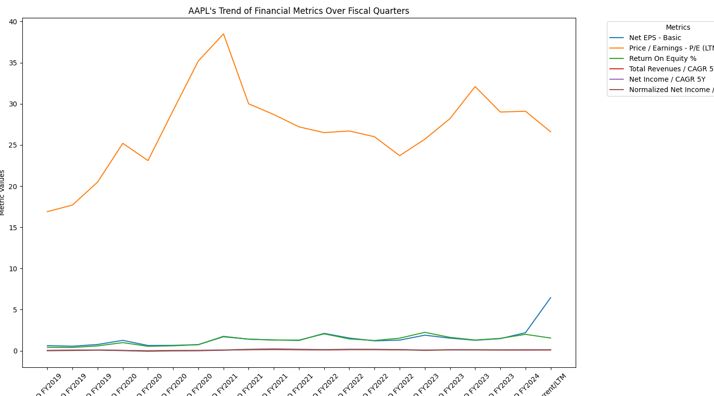

# Classification
찬은 이제 분류 문제를 해결하려 한다.
회귀 문제를 같이 해결했던 Predi는 분류 문제를 전문적으로 해결하는 친구, Classi를 찬에게 소개해준다.

[//]: # (![Classi]&#40;./images/classi.png&#41;)

Classi는 찬에게 전체 과정에서 분류 문제와 회귀 문제가 어떤 부분이 유사한지, 어떤 부분이 다른지 설명해주었다.

##### 분류 문제와 예측 문제의 유사점과 차이점

데이터를 수집하고, 데이터에 대한 이해를 하고, 데이터를 전처리하는 과정은 분류 문제와 회귀 문제가 크게 다르지 않다.
차이가 나는 부분은 모델을 정의하는 과정 중 출력 레이어의 활성화 함수와 손실 함수이다.
회귀 문제에서는 줒로 출력 레이어의 활성화 함수로 linear 함수를 사용하고, 손실 함수로는 mean squared error 함수를 사용하는 반면,
분류 문제는 출력 레이어의 활성화 함수로 softmax 함수를 사용하고, 손실 함수로 cross entropy 함수를 사용한다.
하나의 y를 예측하는 것과 여러 개의 y 중 하나를 선택하는 것의 차이라고 Classi는 설명했다.

찬은 분류 문제를 위해 Tech industry top 10 기업의 5년치 분기별 financial data를 엑셀 데이터로 수집해놓았다. 

찬은 엑셀 데이터와 CSV 데이터를 다루는 차이점을 확인하기 위해 데이터를 .xlsx 형식과 .csv 형식으로 각각 준비했다.

```python
import pandas as pd

xlsx_path = 'data/aapl_fa.xlsx'
data_xlsx = pd.read_excel(xlsx_path)

print(data_xlsx)

csv_path = 'data/aapl_fa.csv'
data_csv = pd.read_csv(csv_path)

print(data_csv)
```

##### XLSX 파일? CSV 파일?

엑셀 파일은 수식이나 포맷, 특정 시트 구조 같은 원본 파일의 정보를 그대로 유지할 수 있지만, CSV 파일에 비해 파일 처리 속도가 다소 느릴 수 있다.
따라서, 데이터가 비교적 단순하고, 처리 속도나 호환성을 중요하게 생각한다면 CSV 파일을 사용하는 것이 좋다고 Classi는 설명했다.

Classi의 말을 듣고 CSV 파일로 데이터를 처리하기로 결정한 찬은 XLSX 파일을 CSV 파일로 변환하는 함수를 작성한다.
data 디렉토리 내부에 CSV 파일이 존재한다면 바로 읽어들이고, 존재하지 않는다면 변환 후 읽어들이는 조건을 추가한다.

```python
import os

def convert_and_read_xlsx(stocks):
    for stock in stocks:
        base_path = f'data/{stock}_fa'
        csv_path = base_path + '.csv'
        xlsx_path = base_path + '.xlsx'

        if os.path.exists(csv_path):
            df_csv = pd.read_csv(csv_path)
            print(f"Reading from CSV for {stock}:")
            print(df_csv.head())
        elif os.path.exists(xlsx_path):
            df_xlsx = pd.read_excel(xlsx_path)

            df_xlsx.to_csv(csv_path, index=False)

            df_csv = pd.read_csv(csv_path)
            print(f"Converted XLSX to CSV for {stock}, now reading CSV:")
            print(df_csv.head())
```

CSV 파일 변환을 완료한 찬은 EDA를 통해 데이터를 분석한 뒤, 전처리에 들어가기로 한다.
찬은 출력의 편의를 위해 하나의 기업 데이터만을 대상으로 EDA를 진행하고 추후에 다른 기업 데이터에도 적용할 수 있도록 코드를 수정하기로 한다.

```python
def eda(stocks):
    csv_path = f'data/{stocks[0]}_fa.csv'

    df_csv = pd.read_csv(csv_path)
    df_csv = df_csv.drop([0, 1], axis=0) # drop the first two rows
    df_csv = df_csv.reset_index(drop=True) # reset the index

    print(f'Exploratory Data Analysis for {stocks[0]}:')
    print(df_csv.head())
    print(df_csv.info())
    print(df_csv.describe())

    df_csv_transposed = df_csv.T # transpose the dataframe to visualize the data conveniently
    df_csv_transposed.columns = df_csv_transposed.iloc[0]
    df_csv_transposed = df_csv_transposed[1:]
    df_csv_transposed = df_csv_transposed.reset_index().rename(columns={'index': 'Fiscal Quarters'})
    df_long = df_csv_transposed.melt(id_vars='Fiscal Quarters', var_name='Metrics', value_name='Values')
    plt.figure(figsize=(20, 8))
    sns.lineplot(data=df_long, x='Fiscal Quarters', y='Values', hue='Metrics')
    plt.title(f'{stocks[0]}\'s Trend of Financial Metrics Over Fiscal Quarters')
    plt.xlabel('Fiscal Quarters')
    plt.ylabel('Metric Values')
    plt.legend(title='Metrics', bbox_to_anchor=(1.05, 1), loc='upper left')
    plt.tight_layout()
    plt.xticks(rotation=45)
    plt.show()
```



간단히 EDA를 마친 찬은 바로 데이터 전처리를 위한 함수를 작성하기 시작한다.

```python
class FinancialDataset(Dataset):
    def __init__(self, data):
        # Data Scaling
        scaler = StandardScaler()
        features = data.drop(['Fiscal Quarters', 'Ticker', 'Target'], axis=1)
        scaled_features = scaler.fit_transform(features)

        # Tensor Transformation
        self.features = torch.tensor(scaled_features, dtype=torch.float)
        self.targets = torch.tensor(data['Target'].values, dtype=torch.float)

    def __len__(self):
        return len(self.features)

    def __getitem__(self, idx):
        return self.features[idx], self.targets[idx]

def preprocess(stocks):
    # [x] - data merging with data loader and feature engineering
    combined_data = pd.DataFrame()
    train_list = []
    validation_list = []
    test_list = []

    for stock in stocks:
        csv_path = f'data/{stock}_fa.csv'
        df_csv = pd.read_csv(csv_path, na_values='-')
        df_csv = df_csv.drop([0, 1], axis=0)
        df_csv = df_csv.reset_index(drop=True)
        df_csv_transposed = df_csv.T # transpose the dataframe to visualize the data conveniently
        df_csv_transposed.columns = df_csv_transposed.iloc[0] # set the first row as the metrics name
        df_csv_transposed = df_csv_transposed[1:] # drop the first row
        df_csv_transposed = df_csv_transposed.reset_index().rename(columns={'index': 'Fiscal Quarters'}) # rename the columns
        df_csv_transposed['Ticker'] = stock # add the ticker column
        df_csv_transposed['Target'] = 0 # add the target column (whether the stock will be stalwartz or growth)

        # Data Splitting
        train_ratio = 0.7
        validation_ratio = 0.2
        test_ratio = 0.1
        train_size = int(train_ratio * len(df_csv_transposed))
        validation_size = int(validation_ratio * len(df_csv_transposed))
        test_size = len(df_csv_transposed) - train_size - validation_size

        train_list.append(df_csv_transposed[:train_size])
        validation_list.append(df_csv_transposed[train_size:train_size+validation_size])
        test_list.append(df_csv_transposed[train_size+validation_size:])

        combined_data = pd.concat([combined_data, df_csv_transposed], axis=0)

    train_data = pd.concat(train_list)
    validation_data = pd.concat(validation_list)
    test_data = pd.concat(test_list)

    X_train = FinancialDataset(train_data)
    X_validation = FinancialDataset(validation_data)
    X_test = FinancialDataset(test_data)

    train_loader = DataLoader(X_train, batch_size=32)
    validation_loader = DataLoader(X_validation, batch_size=32)
    test_loader = DataLoader(X_test, batch_size=32)

    return train_loader, validation_loader, test_loader
```