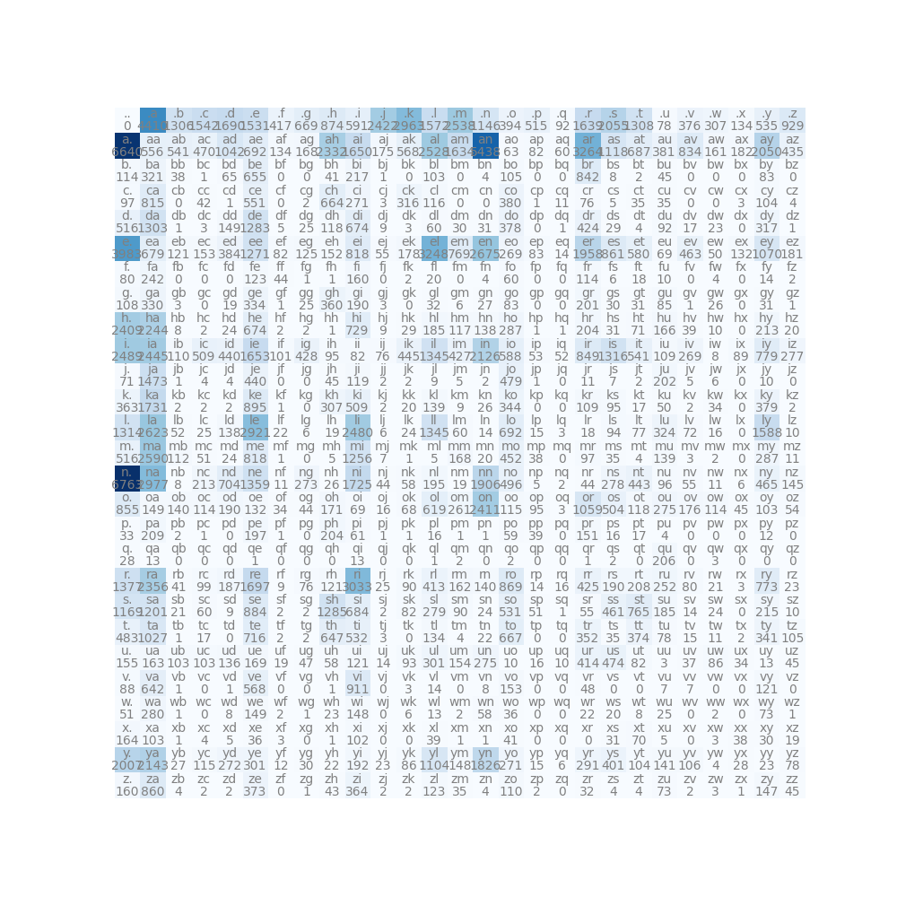

# Let's Build GPT

This time, we will build a Natural Language Processing model from a bigram character-level model to modern transformer-based model. 

Everything I'll do is based on the YouTube series from [Zero to Hero](https://www.youtube.com/playlist?list=PLAqhIrjkxbuWI23v9cThsA9GvCAUhRvKZ) by Andrej Karpathy.

#### First of all, what is the difference between bigram and transformer model?

Bigram model is a simple model that predicts the next character based on the previous character one by one.
While transformer model uses attention mechanism to predicts the next character based on the whole sequence of characters.

So, bigram model is a good start to understand the basics of NLP model.

## Bigram model

We have a text file, which is a list of names. If we take a look at the file,
```python
words = with open('names.txt', 'r').read().splitlines()

print(words[:10]) # ['emma', 'olivia', 'ava', 'isabella', 'sophia', 'charlotte', 'mia', 'amelia', 'harper', 'evelyn']
```

Since bigram looks at two consecutive characters, we need to sliding through the text to get the bigram pairs.
```python
for w in words[:1]: # take only the first word
    chs = ['<S>'] + list(w) + ['<E>'] # add start and end token
    for ch1, ch2 in zip(chs, chs[1:]):
        print(ch1, ch2)
# <S> e        
# e m
# m m
# m a
# a <E>
```

As we saw above, model will take a character and predict which character will come next based on probability.
In order to do that, simplest way is to count the frequency of each bigram pair.

```python
b = {}
for w in words[:3]: # take only the first word
    chs = ['<S>'] + list(w) + ['<E>'] # add start and end token
    for ch1, ch2 in zip(chs, chs[1:]):
        bigram = (ch1, ch2)
        b[bigram] = b.get(bigram, 0) + 1
print(b)
# {('<S>', 'e'): 1, ('e', 'm'): 1, ..., ('a', '<E>'): 3, ...}
```

Now, sort the pairs by frequency in all words.

```python
b = {}
for w in words:
    ...
print(sorted(b.items(), key=lambda kv: -kv[1]))
# [(('n', '<E>'), 6763), (('a', '<E>'), 6640), (('a', 'n'), 5438), ...]
```

The way that is going to be more convenient for us is to keep this information in a two-dimensional array, instead of a python dictionary.
The rows will be the first character and the columns will be the second character, and each entry will tell us how often the second character follows the first.

```python
import torch

N = torch.zeros((28, 28), dtype=torch.int32) # 26 letters + start and end token
chars = sorted(list(set(''.join(words))))
stoi = {s:i for i, s in enumerate(chars)} # Since we have to index using integers, we need some kind of a lookup table from characters to integers
stoi['<S>'] = 26
stoi['<E>'] = 27

for w in words:
    chs = ['<S>'] + list(w) + ['<E>']
    for ch1, ch2 in zip(chs, chs[1:]):
        ix1, ix2 = stoi[ch1], stoi[ch2]
        N[ix1, ix2] += 1
print(N)
# tensor([[   0,  6763,  6640,  ...,     0,     0,     0], ...])
```

In order to visualize the lookup table, Andrej gave us a bunch of code. I'll just copy and paste it here.

```python
itos = {i:s for s, i in stoi.items()}

plt.figure(figsize=(10, 10))
plt.imshow(N, cmap='Blues')
for i in range(27):
    for j in range(27):
        chstr = itos[i] + itos[j]
        plt.text(j, i, chstr, ha='center', va='bottom', color='gray')
        plt.text(j, i, N[i, j].item(), ha='center', va='top', color='gray')
plt.axis('off')
plt.show()
```

And the result is like this:


Now, we need to convert the lookup table to a probability table and sample from it.
We can do this by some library functions, torch.multinomial() and torch.generator().

To understand the functions, let's play with them a little bit.

```python
g = torch.Generator().manual_seed(2147484647) # seed for reproducibility
p = torch.rand(3, generator=g)
p /= p.sum()
print(p)
# tensor([0.3371, 0.5802, 0.0827]) # sum is 1

print(torch.multinomial(p, num_samples=20, replacement=True, generator=g).item())
# tensor([1, 1, 1, 1, 1, 1, 1, 0, 1, 0, 1, 0, 2, 1, 1, 0, 0, 1, 1, 2]) # 33% of 0, 58% of 1, 8% of 2
```

Generator has a deterministic behavior, so if we use the same seed, we will get the same result every time we run the code. 
Multinomial function samples from the probability distribution p.

Now, let's implement the sampling in loop.

```python
g = torch.Generator().manual_seed(2147484647)
for i in range(10):
    ix = 0
    out = []
    while True:
        p = N[ix].float()
        p /= p.sum()
        ix = torch.multinomial(p, num_samples=1, replacement=True, generator=g).item()
        out.append(itos[ix])
        if ix == 0:
            break
    print(''.join(out))
# nantabrae.
# jahis.
# aje.
# h.
# annlelileshlamahaanlylurilameenehre.
# r.
# ay.
# disarere.
# bisalistizmmevajheilllin.
# inn.
```

The result is not good, but it's working.
Still, here are rooms for improvements. We always fetching a row of N, converting it to float and normalizing it, which is not efficient.
Instead of doing this, we can precompute the probabilities and store them in a separate tensor.

```python
P = N.float()
P /= P.sum(dim=1, keepdim=True) # check documentation about torch.sum() and broadcasting rules
for i in range(10):
    ...
    while True:
        p = P[ix]
        ...
    print(''.join(out))
```

Now, how can we evaluate quality of the model?

We can use likelihood, particularly log-likelihood in this case, to measure whether the model's output is useful or not.

```python
log_likelihood = 0
n = 0
for w in words[:3]:
    chars = ['.'] + list(w) + ['.']
    for (ch1, ch2) in zip(chars, chars[1:]):
        ix1, ix2 = stoi[ch1], stoi[ch2]
        prob = P[ix1, ix2]
        log_likelihood += torch.log(prob)
        n += 1
        print(f'{ch1}{ch2}: {prob:.4f} {log_likelihood:.4f}')
        # .e: 0.0478 -3.0410
        # em: 0.0377 -6.3204
        # mm: 0.0253 -9.9957
        # ma: 0.3885 -10.9411
        # a.: 0.1958 -12.5716
print(f'{log_likelihood=}') # log_likelihood=tensor(-38.8086)
print(f'{-log_likelihood=}') # negative log_likelihood=tensor(38.8086)
print(f'{-log_likelihood/n=}') # normalized negative log_likelihood=tensor(2.425)
```

If given a word 'Andrejq', log-likelihood becomes negative infinity. It's because 'jq' has 0 probability in the lookup table.
To avoid this, we can add a small value to the probability.

```python
P = (N+1).float() # add-one smoothing
```

--------------------------------------------

Here is another approach to do the same thing: gradient descent.

In order to do this, we need input that is fed to the model and the target that is the next character.

```python
xs, ys = [], []
for w in words[:1]:
    chars = ['.'] + list(w) + ['.']
    for (ch1, ch2) in zip(chars, chars[1:]):
        ix1, ix2 = stoi[ch1], stoi[ch2]
        xs.append(ix1)
        ys.append(ix2)
xs = torch.tensor(xs)
ys = torch.tensor(ys)

print(xs) # tensor([ 0,  5, 13, 13,  1]) 
print(ys) # tensor([ 5, 13, 13,  1,  0])
```

However, neural networks are not good at digesting integers directly because integers are imply an ordinal relationship or a specific order that might not exist.
So, we need to convert them into one-hot vectors.

```python
import torch.nn.functional as F

xenc = F.one_hot(xs, num_classes=27).float()
print(xenc) # tensor([[1., 0., 0., 0., 0., 0., 0., 0., 0., ...], ...])
print(xenc.shape) # torch.Size([5, 27])
```

Neurons in the neural network perform `y = Wx + b` operation, where W is the weight matrix that needs to be initialized and b is omitted in this case.

```python
W = torch.randn((27, 27))
print(xenc @ W) # [[ 0.6036, -0.1056, -1.0630,  1.0607,  0.4728,  1.1745, -0.3056, ...], ...]
print((xenc @ W).shape) # (5, 27) @ (27, 27) = (5, 27)
```

Having both positive and negative values in the results can complicate interpretation.
To address this, we can exponentiate the results, thus transforming them to a more interpretable scale comparable to the original counts.

```python
logits = xenc @ W # log-counts
counts = logits.exp() # equivalent to N matrix
probs = counts / counts.sum(dim=1, keepdim=True)
"""the last 2 lines here are together called a 'softmax'"""
print(counts) # [[ 0.5346, 10.1324,  0.1837,  0.2718,  0.3520,  1.2849,  0.6202,  0.3240, ...], ...]
print(probs) # [[0.0210, 0.0167, 0.0093, 0.0612, 0.0072, 0.0276, 0.0149, 0.0263, 0.0098, ...], ...]
print(probs.shape) # (5, 27)
```

Three things we get from the above, log-counts, counts, and probabilities, are all differentiable, so we can backpropagate through them.
The reason why we backpropagate is to modify the weights to get better probabilities.

```python
g = torch.Generator().manual_seed(2147484647)
W = torch.randn((27, 27), generator=g, requires_grad=True)
num = xs.nelement()

for k in range(100):
    # forward pass
    xenc = F.one_hot(xs, num_classes=27).float()
    logits = xenc @ W
    counts = logits.exp()
    probs = counts / counts.sum(dim=1, keepdim=True)
    loss = -probs[torch.arange(num), ys].log().mean()
    print('loss: ', loss.item())
    
    # backward pass
    W.grad = None
    loss.backward()
    
    # update weights
    W.data += -0.1 * W.grad

# loss:  4.130396366119385
# loss:  4.108096122741699
# loss:  4.085860252380371
# ...
# loss:  2.2773678302764893
# loss:  2.2619788646698
# loss:  2.246675968170166
```

The loss is closing to the normalized negative log-likelihood we calculated before.
The result is not significantly different from the previous one, however, neural networks provide a more flexible approach and can be extended to more complex models.