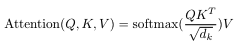

# Let's Build GPT

This time, we will build a Natural Language Processing model from a bigram character-level model to modern transformer-based model. 

Everything I'll do is based on the YouTube series from [Zero to Hero](https://www.youtube.com/playlist?list=PLAqhIrjkxbuWI23v9cThsA9GvCAUhRvKZ) by Andrej Karpathy.

#### First of all, what is the difference between bigram and transformer model?

Bigram model is a simple model that predicts the next character based on the previous character one by one.
While transformer model uses attention mechanism to predicts the next character based on the whole sequence of characters.

So, bigram model is a good start to understand the basics of NLP model.

## Bigram Model

We have a text file, which is a list of names. If we take a look at the file,
```python
words = with open('names.txt', 'r').read().splitlines()

print(words[:10]) # ['emma', 'olivia', 'ava', 'isabella', 'sophia', 'charlotte', 'mia', 'amelia', 'harper', 'evelyn']
```

Since bigram looks at two consecutive characters, we need to sliding through the text to get the bigram pairs.
```python
for w in words[:1]: # take only the first word
    chs = ['<S>'] + list(w) + ['<E>'] # add start and end token
    for ch1, ch2 in zip(chs, chs[1:]):
        print(ch1, ch2)
# <S> e        
# e m
# m m
# m a
# a <E>
```

As we saw above, model will take a character and predict which character will come next based on probability.
In order to do that, simplest way is to count the frequency of each bigram pair.

```python
b = {}
for w in words[:3]: # take only the first word
    chs = ['<S>'] + list(w) + ['<E>'] # add start and end token
    for ch1, ch2 in zip(chs, chs[1:]):
        bigram = (ch1, ch2)
        b[bigram] = b.get(bigram, 0) + 1
print(b)
# {('<S>', 'e'): 1, ('e', 'm'): 1, ..., ('a', '<E>'): 3, ...}
```

Now, sort the pairs by frequency in all words.

```python
b = {}
for w in words:
    ...
print(sorted(b.items(), key=lambda kv: -kv[1]))
# [(('n', '<E>'), 6763), (('a', '<E>'), 6640), (('a', 'n'), 5438), ...]
```

The way that is going to be more convenient for us is to keep this information in a two-dimensional array, instead of a python dictionary.
The rows will be the first character and the columns will be the second character, and each entry will tell us how often the second character follows the first.

```python
import torch

N = torch.zeros((28, 28), dtype=torch.int32) # 26 letters + start and end token
chars = sorted(list(set(''.join(words))))
stoi = {s:i for i, s in enumerate(chars)} # Since we have to index using integers, we need some kind of a lookup table from characters to integers
stoi['<S>'] = 26
stoi['<E>'] = 27

for w in words:
    chs = ['<S>'] + list(w) + ['<E>']
    for ch1, ch2 in zip(chs, chs[1:]):
        ix1, ix2 = stoi[ch1], stoi[ch2]
        N[ix1, ix2] += 1
print(N)
# tensor([[   0,  6763,  6640,  ...,     0,     0,     0], ...])
```

In order to visualize the lookup table, Andrej gave us a bunch of code. I'll just copy and paste it here.

```python
itos = {i:s for s, i in stoi.items()}

plt.figure(figsize=(10, 10))
plt.imshow(N, cmap='Blues')
for i in range(27):
    for j in range(27):
        chstr = itos[i] + itos[j]
        plt.text(j, i, chstr, ha='center', va='bottom', color='gray')
        plt.text(j, i, N[i, j].item(), ha='center', va='top', color='gray')
plt.axis('off')
plt.show()
```

And the result is like this:


Now, we need to convert the lookup table to a probability table and sample from it.
We can do this by some library functions, torch.multinomial() and torch.generator().

To understand the functions, let's play with them a little bit.

```python
g = torch.Generator().manual_seed(2147484647) # seed for reproducibility
p = torch.rand(3, generator=g)
p /= p.sum()
print(p)
# tensor([0.3371, 0.5802, 0.0827]) # sum is 1

print(torch.multinomial(p, num_samples=20, replacement=True, generator=g).item())
# tensor([1, 1, 1, 1, 1, 1, 1, 0, 1, 0, 1, 0, 2, 1, 1, 0, 0, 1, 1, 2]) # 33% of 0, 58% of 1, 8% of 2
```

Generator has a deterministic behavior, so if we use the same seed, we will get the same result every time we run the code. 
Multinomial function samples from the probability distribution p.

Now, let's implement the sampling in loop.

```python
g = torch.Generator().manual_seed(2147484647)
for i in range(10):
    ix = 0
    out = []
    while True:
        p = N[ix].float()
        p /= p.sum()
        ix = torch.multinomial(p, num_samples=1, replacement=True, generator=g).item()
        out.append(itos[ix])
        if ix == 0:
            break
    print(''.join(out))
# nantabrae.
# jahis.
# aje.
# h.
# annlelileshlamahaanlylurilameenehre.
# r.
# ay.
# disarere.
# bisalistizmmevajheilllin.
# inn.
```

The result is not good, but it's working.
Still, here are rooms for improvements. We always fetching a row of N, converting it to float and normalizing it, which is not efficient.
Instead of doing this, we can precompute the probabilities and store them in a separate tensor.

```python
P = N.float()
P /= P.sum(dim=1, keepdim=True) # check documentation about torch.sum() and broadcasting rules
for i in range(10):
    ...
    while True:
        p = P[ix]
        ...
    print(''.join(out))
```

Now, how can we evaluate quality of the model?

We can use likelihood, particularly log-likelihood in this case, to measure whether the model's output is useful or not.

```python
log_likelihood = 0
n = 0
for w in words[:3]:
    chars = ['.'] + list(w) + ['.']
    for (ch1, ch2) in zip(chars, chars[1:]):
        ix1, ix2 = stoi[ch1], stoi[ch2]
        prob = P[ix1, ix2]
        log_likelihood += torch.log(prob)
        n += 1
        print(f'{ch1}{ch2}: {prob:.4f} {log_likelihood:.4f}')
        # .e: 0.0478 -3.0410
        # em: 0.0377 -6.3204
        # mm: 0.0253 -9.9957
        # ma: 0.3885 -10.9411
        # a.: 0.1958 -12.5716
print(f'{log_likelihood=}') # log_likelihood=tensor(-38.8086)
print(f'{-log_likelihood=}') # negative log_likelihood=tensor(38.8086)
print(f'{-log_likelihood/n=}') # normalized negative log_likelihood=tensor(2.425)
```

If given a word 'Andrejq', log-likelihood becomes negative infinity. It's because 'jq' has 0 probability in the lookup table.
To avoid this, we can add a small value to the probability.

```python
P = (N+1).float() # add-one smoothing
```

--------------------------------------------

Here is another approach to do the same thing: gradient descent.

In order to do this, we need input that is fed to the model and the target that is the next character.

```python
xs, ys = [], []
for w in words[:1]:
    chars = ['.'] + list(w) + ['.']
    for (ch1, ch2) in zip(chars, chars[1:]):
        ix1, ix2 = stoi[ch1], stoi[ch2]
        xs.append(ix1)
        ys.append(ix2)
xs = torch.tensor(xs)
ys = torch.tensor(ys)

print(xs) # tensor([ 0,  5, 13, 13,  1]) 
print(ys) # tensor([ 5, 13, 13,  1,  0])
```

However, neural networks are not good at digesting integers directly because integers are imply an ordinal relationship or a specific order that might not exist.
So, we need to convert them into one-hot vectors.

```python
import torch.nn.functional as F

xenc = F.one_hot(xs, num_classes=27).float()
print(xenc) # tensor([[1., 0., 0., 0., 0., 0., 0., 0., 0., ...], ...])
print(xenc.shape) # torch.Size([5, 27])
```

Neurons in the neural network perform `y = Wx + b` operation, where W is the weight matrix that needs to be initialized and b is omitted in this case.

```python
W = torch.randn((27, 27))
print(xenc @ W) # [[ 0.6036, -0.1056, -1.0630,  1.0607,  0.4728,  1.1745, -0.3056, ...], ...]
print((xenc @ W).shape) # (5, 27) @ (27, 27) = (5, 27)
```

Having both positive and negative values in the results can complicate interpretation.
To address this, we can exponentiate the results, thus transforming them to a more interpretable scale comparable to the original counts.

```python
logits = xenc @ W # log-counts
counts = logits.exp() # equivalent to N matrix
probs = counts / counts.sum(dim=1, keepdim=True)
"""the last 2 lines here are together called a 'softmax'"""
print(counts) # [[ 0.5346, 10.1324,  0.1837,  0.2718,  0.3520,  1.2849,  0.6202,  0.3240, ...], ...]
print(probs) # [[0.0210, 0.0167, 0.0093, 0.0612, 0.0072, 0.0276, 0.0149, 0.0263, 0.0098, ...], ...]
print(probs.shape) # (5, 27)
```

Three things we get from the above, log-counts, counts, and probabilities, are all differentiable, so we can backpropagate through them.
The reason why we backpropagate is to modify the weights to get better probabilities.

```python
g = torch.Generator().manual_seed(2147484647)
W = torch.randn((27, 27), generator=g, requires_grad=True)
num = xs.nelement()

for k in range(100):
    # forward pass
    xenc = F.one_hot(xs, num_classes=27).float()
    logits = xenc @ W
    counts = logits.exp()
    probs = counts / counts.sum(dim=1, keepdim=True)
    loss = -probs[torch.arange(num), ys].log().mean()
    print('loss: ', loss.item())
    
    # backward pass
    W.grad = None
    loss.backward()
    
    # update weights
    W.data += -0.1 * W.grad

# loss:  4.130396366119385
# loss:  4.108096122741699
# loss:  4.085860252380371
# ...
# loss:  2.2773678302764893
# loss:  2.2619788646698
# loss:  2.246675968170166
```

The loss is closing to the normalized negative log-likelihood we calculated before.
The result is not significantly different from the previous one, however, neural networks provide a more flexible approach and can be extended to more complex models.

## Transformer Model
In this chapter, we dive into the transformer model, which uses more context to predict the next character.

Same as before, we brought the text file first and look into it to see what it looks like.

```python
# Load the text data
with open('input.txt', 'r', encoding='utf-8') as f:
    text = f.read()

# Overview of the text
print('length of text: ', len(text))
print(text[:100])

chars = sorted(list(set(text)))
vocab_size = len(chars)
print(''.join(chars))
print('vocab size: ', vocab_size)

# length of text:  1115394
# First Citizen:
# Before we proceed any further, hear me speak.
# 
# All:
# Speak, speak.
# 
# First Citizen:
# You
# 
#  !$&',-.3:;?ABCDEFGHIJKLMNOPQRSTUVWXYZabcdefghijklmnopqrstuvwxyz
# vocab size:  65
```

The text is a part of Shakespeare's play, and it has 65 unique characters.

Now, we need to tokenize the text into integers.

```python
# Tokenize the text
stoi = {ch:i for i, ch in enumerate(chars)}
itos = {i:ch for ch, i in stoi.items()}
encode = lambda s: [stoi[c] for c in s]
decode = lambda l: ''.join([itos[i] for i in l])

print(encode('hii there'))
print(decode(encode('hii there')))

# [46, 47, 47, 1, 58, 46, 43, 56, 43]
# hii there
```

Using this encode function, encode the entire text dataset and store it into a tensor.

```python
data = torch.tensor(encode(text), dtype=torch.long)
print(data[:100])

# [18, 47, 56, 57, 58,  1, 15, 47, 58, 47, 64, 43, 52, 10,  0, 14, 43, 44, ...]
```

Before we go further, we split the dataset into training and validation sets.

```python
# Split up the data into train and validation sets
n = int(0.9*(len(data)))
train_data, val_data = data[:n], data[n:]
```

We don't feed the entire text at once to the model, thus we need to chunk the data into batches.

```python
# Chunk the data into batches
block_size = 8
print(train_data[:block_size+1])

# tensor([18, 47, 56, 57, 58,  1, 15, 47, 58])
```

The reason why we set the block size to 8 plus 1 is that we need to predict the next character based on the previous characters in a accumulated manner.

```python
x = train_data[:block_size+1]
y = train_data[1:block_size+1]
for t in range(block_size):
    context = x[:t+1]
    target = y[t]
    print(f'when input is {context} the target: {target}')
    
# when input is tensor([18]) the target: 47
# when input is tensor([18, 47]) the target: 56
# when input is tensor([18, 47, 56]) the target: 57
# when input is tensor([18, 47, 56, 57]) the target: 58
# when input is tensor([18, 47, 56, 57, 58]) the target: 1
# when input is tensor([18, 47, 56, 57, 58,  1]) the target: 15
# when input is tensor([18, 47, 56, 57, 58,  1, 15]) the target: 47
# when input is tensor([18, 47, 56, 57, 58,  1, 15, 47]) the target: 58
```

Now, we take concern into the batches.

```python
# Take a concern of the batches
batch_size = 4
block_size = 8

def get_batch(split):
    data = train_data if split == 'train' else val_data
    ix = torch.randint(len(data) - block_size, (batch_size,))
    x = torch.stack([data[i:i+block_size] for i in ix])
    y = torch.stack([data[i+1:i+block_size+1] for i in ix])
    return x, y

xb, yb = get_batch('train')
print('input: ')
print(xb)
print('target: ')
print(yb)
# 
# input: 
# tensor([[ 0, 17, 24, 14, 27, 35, 10,  0],
#         [53, 53, 42,  1, 55, 59, 43, 43],
#         [11,  1, 57, 54, 43, 39, 49,  1],
#         [56,  6,  0, 27, 44,  1, 17, 57]])
# target: 
# tensor([[17, 24, 14, 27, 35, 10,  0, 27],
#         [53, 42,  1, 55, 59, 43, 43, 52],
#         [ 1, 57, 54, 43, 39, 49,  1, 44],
#         [ 6,  0, 27, 44,  1, 17, 57, 57]])

for b in range(batch_size): # batch dimension
    for t in range(block_size): # time dimension
        context = xb[b, :t+1]
        target = yb[b, t]
        print(f'when input is {context} the target: {target}')

# when input is tensor([0]) the target: 17
# when input is tensor([ 0, 17]) the target: 24
# when input is tensor([ 0, 17, 24]) the target: 14
# when input is tensor([ 0, 17, 24, 14]) the target: 27
# when input is tensor([ 0, 17, 24, 14, 27]) the target: 35
# when input is tensor([ 0, 17, 24, 14, 27, 35]) the target: 10
# when input is tensor([ 0, 17, 24, 14, 27, 35, 10]) the target: 0
# when input is tensor([ 0, 17, 24, 14, 27, 35, 10,  0]) the target: 27
# ...
```

It's time to build the transformer model.
Before we do that, we start from the basic building block, which is the bigram model.

```python
class BigramLanguageModel(nn.Module):

    def __init__(self, vocab_size):
        super().__init__()
        self.token_embedding = nn.Embedding(vocab_size, vocab_size)

    def forward(self, idx, targets=None):

        # idx and targets are both (B, T) tensor of integers
        logits = self.token_embedding(idx)

        if targets is None:
            loss = None
        else:
            B, T, C = logits.shape
            logits = logits.view(B*T, C)
            targets = targets.view(B*T)
            loss = F.cross_entropy(logits, targets)

        return logits, loss

    def generate(self, idx, max_new_tokens):
        for _ in range(max_new_tokens):
            logits, loss = self(idx) # get the predictions
            logits = logits[:, -1, :] # focus only on the last time step
            probs = F.softmax(logits, dim=-1) # apply softmax to get probabilities
            idx_next = torch.multinomial(probs, num_samples=1) # sample from the distribution
            idx = torch.cat((idx, idx_next), dim=-1) # append sampled index to the running sequence
        return idx

m = BigramLanguageModel(vocab_size)
logits, loss = m(xb, yb)
print(logits.shape)
print(loss)
print(decode(m.generate(torch.zeros((1, 1), dtype=torch.long), max_new_tokens=100)[0].tolist()))

# torch.Size([32, 65])
# tensor(4.7277, grad_fn=<NllLossBackward0>)

# hSQaeMjOH;eF!oT?A;sYEvuhYxnu$VjeKcOHjhu$BfA3aCTLha.GKNqC oSI
# VQGd,'f
# !Xj&H'rX!S'AyxoEFt$x:cm,ttUKmad
```

The model is working, but results are garbage. It's because the model predicts based on the previous character only and is not trained yet.

Let's dig into the BigramLanguageModel class above.
1. Initializing: When you use an embedding layer in PyTorch, it transforms each input integer into a dense vector of fixed size. In this case, the size is the same as the vocabulary size.
2. Forward: The forward takes the input index and the target index. It returns the logits, which are the raw predictions of the model that the model generates for each token in the vocabulary for the last token in the current sequence, and the loss.
In order to calculate the loss, we need to reshape the logits and targets to a 2D tensor.
3. Generate: As we simply implemented above, the generate function generates a sequence of tokens.
4. Decode: Using 1 by 1 tensor, which is filled with zeros, the model generates a sequence of tokens randomly and decodes it to a string.

It's time to train the model.

```python
optimizer = torch.optim.AdamW(m.parameters(), lr=1e-3)

batch_size = 32
for steps in range(10000):

    xb, yb = get_batch('train')
    logits, loss = m(xb, yb)
    optimizer.zero_grad(set_to_none=True)
    loss.backward()
    optimizer.step()

print(loss.item())
print(decode(m.generate(torch.zeros((1, 1), dtype=torch.long), max_new_tokens=100)[0].tolist()))

# 2.5115904808044434

# Thigs d ht n r,
# TRot yaint wetersero myo s in
# ENCo ey oke
# MA:
# Yorgowatamy m Ithas, baithenese foy d 
```

Before we move on, do some refactoring to make the code more readable.

```python
# Hyperparameters
batch_size = 32 # how many independent sequences will we process in parallel?
block_size = 8 # what is the maximum length for prediction?
max_iters = 10000
eval_interval = 500
learning_rate = 1e-3
eval_iters = 200
n_embd = 32
device = 'cuda' if torch.cuda.is_available() else 'cpu'
# ----------------

torch.manual_seed(1337) # for reproducibility

# refactoring caused by device variable
def get_batch(split):
    ...
    x, y = x.to(device), y.to(device)
    return x, y

model = BigramLanguageModel(vocab_size)
m = model.to(device)

context = torch.zeros((1, 1), dtype=torch.long, device=device)
print(decode(m.generate(context, max_new_tokens=500)[0].tolist()))
# ----------------

# refactoring for getting less noisy loss
@torch.no_grad( # no need to compute gradients
def estimate_loss():
    out = {}
    model.eval()
    for split in ['train', 'val']:
        losses = torch.zeros(eval_iters)
        for k in range(eval_iters):
            X, Y = get_batch(split)
            logits, loss = model(X, Y)
            losses[k] = loss.item()
        out[split] = losses.mean()
    model.train()
    return out

for iter in range(max_iters):
    
    if iter % eval_iters == 0:
    losses = estimate_loss()
    print(f'step {iter}: train loss {losses["train"]:.4f}, val loss {losses["val"]:.4f}')
    
    ...

# step 0: train loss 4.7305, val loss 4.7241
# step 200: train loss 4.4900, val loss 4.4977
# step 400: train loss 4.2719, val loss 4.2818
# ...
# step 9400: train loss 2.4658, val loss 2.4982
# step 9600: train loss 2.4726, val loss 2.4942
# step 9800: train loss 2.4673, val loss 2.4939
```

Now, let's get closer to the transformer model.
Before we implement self-attention with n-heads, we need to understand the mathematical trick under the hood.

We have a sequence of tokens, which is a matrix of shape (B, T, C), where B is the batch size, T is the number of tokens, and C is the dimension of the token embedding.
We would like to see communication between each token in the sequence, however, when we look at fifth token, do not communicate with sixth, seventh, and eighth token.
It's because tokens that above the fifth token are future tokens in that context.

```python
# Version 1 - explicit loop
torch.manual_seed(1337)
B, T, C = 4,8,2 # batch, time, channels
x = torch.randn(B,T,C)

xbow = torch.zeros((B,T,C))
for b in range(B):
  for t in range(T):
    xprev = x[b,:t+1]
    xbow[b,t] = torch.mean(xprev, 0)

print(x[0], xbow[0])
# (tensor([[ 0.1808, -0.0700],
#          [-0.3596, -0.9152],
#          [ 0.6258,  0.0255],
#          [ 0.9545,  0.0643],
#          [ 0.3612,  1.1679],
#          [-1.3499, -0.5102],
#          [ 0.2360, -0.2398],
#          [-0.9211,  1.5433]]),
#  tensor([[ 0.1808, -0.0700],
#          [-0.0894, -0.4926],
#          [ 0.1490, -0.3199],
#          [ 0.3504, -0.2238],
#          [ 0.3525,  0.0545],
#          [ 0.0688, -0.0396],
#          [ 0.0927, -0.0682],
#          [-0.0341,  0.1332]]))
```

The xbow tensor is the average of the previous tokens for each token in the sequence.

Here is the mathematical trick that do the same thing more efficiently.

```python
a = torch.tril(torch.ones(3, 3))
a /= a.sum(1, keepdim=True)
b = torch.randint(0, 10, (3, 2))
c = a @ b
print('a=')
print(a)
print('-----')
print('b=')
print(b)
print('-----')
print('c=')
print(c)

# a=
# tensor([[1.0000, 0.0000, 0.0000],
#         [0.5000, 0.5000, 0.0000],
#         [0.3333, 0.3333, 0.3333]])
# -----
# b=
# tensor([[2., 7.],
#         [6., 4.],
#         [6., 5.]])
# -----
# c=
# tensor([[2.0000, 7.0000],
#         [4.0000, 5.5000],
#         [4.6667, 5.3333]])
```

```python
# Version 2 - matrix multiplication
wei = torch.tril(torch.ones(T, T))
wei /= wei.sum(1, keepdim=True)
xbow2 = wei @ x
print(xbow2[0])
# tensor([[ 0.1808, -0.0700],
#         [-0.0894, -0.4926],
#         [ 0.1490, -0.3199],
#         [ 0.3504, -0.2238],
#         [ 0.3525,  0.0545],
#         [ 0.0688, -0.0396],
#         [ 0.0927, -0.0682],
#         [-0.0341,  0.1332]])
```

Using the torch.tril() function and matrix multiplication, we can get the same result as before in a more efficient way due to the use of vectorized operations.

More version of the same trick below.

```python
# Version 3 - softmax
tril = torch.tril(torch.ones(T, T))
wei = torch.zeros((T, T))
wei = wei.masked_fill(tril == 0, float('-inf'))
print(wei)
# tensor([[0., -inf, -inf, -inf, -inf, -inf, -inf, -inf],
#         [0., 0., -inf, -inf, -inf, -inf, -inf, -inf],
#         [0., 0., 0., -inf, -inf, -inf, -inf, -inf],
#         [0., 0., 0., 0., -inf, -inf, -inf, -inf],
#         [0., 0., 0., 0., 0., -inf, -inf, -inf],
#         [0., 0., 0., 0., 0., 0., -inf, -inf],
#         [0., 0., 0., 0., 0., 0., 0., -inf],
#         [0., 0., 0., 0., 0., 0., 0., 0.]])

wei = F.softmax(wei, dim=-1)
print(wei)
# tensor([[1.0000, 0.0000, 0.0000, 0.0000, 0.0000, 0.0000, 0.0000, 0.0000],
#         [0.5000, 0.5000, 0.0000, 0.0000, 0.0000, 0.0000, 0.0000, 0.0000],
#         [0.3333, 0.3333, 0.3333, 0.0000, 0.0000, 0.0000, 0.0000, 0.0000],
#         [0.2500, 0.2500, 0.2500, 0.2500, 0.0000, 0.0000, 0.0000, 0.0000],
#         [0.2000, 0.2000, 0.2000, 0.2000, 0.2000, 0.0000, 0.0000, 0.0000],
#         [0.1667, 0.1667, 0.1667, 0.1667, 0.1667, 0.1667, 0.0000, 0.0000],
#         [0.1429, 0.1429, 0.1429, 0.1429, 0.1429, 0.1429, 0.1429, 0.0000],
#         [0.1250, 0.1250, 0.1250, 0.1250, 0.1250, 0.1250, 0.1250, 0.1250]])

xbow3 = wei @ x
print(xbow3[0])
# tensor([[ 0.1808, -0.0700],
#         [-0.0894, -0.4926],
#         [ 0.1490, -0.3199],
#         [ 0.3504, -0.2238],
#         [ 0.3525,  0.0545],
#         [ 0.0688, -0.0396],
#         [ 0.0927, -0.0682],
#         [-0.0341,  0.1332]])
```

```python
# Version 4 - self-attention

torch.manual_seed(1337)
B,T,C = 4,8,32
x = torch.randn(B,T,C)

head_size = 16
key = nn.Linear(C, head_size, bias=False)
query = nn.Linear(C, head_size, bias=False)
value = nn.Linear(C, head_size, bias=False)
k = key(x)
q = query(x)
wei = q @ k.transpose(-2, -1)

tril = torch.tril(torch.ones(T,T))
wei = wei.masked_fill(tril == 0, float('-inf'))
wei = F.softmax(wei, dim=-1)

v = value(x)
out = wei @ v

print(out.shape) # torch.Size([4, 8, 16])
print(wei[0])
# tensor([[1.0000, 0.0000, 0.0000, 0.0000, 0.0000, 0.0000, 0.0000, 0.0000],
#         [0.1574, 0.8426, 0.0000, 0.0000, 0.0000, 0.0000, 0.0000, 0.0000],
#         [0.2088, 0.1646, 0.6266, 0.0000, 0.0000, 0.0000, 0.0000, 0.0000],
#         [0.5792, 0.1187, 0.1889, 0.1131, 0.0000, 0.0000, 0.0000, 0.0000],
#         [0.0294, 0.1052, 0.0469, 0.0276, 0.7909, 0.0000, 0.0000, 0.0000],
#         [0.0176, 0.2689, 0.0215, 0.0089, 0.6812, 0.0019, 0.0000, 0.0000],
#         [0.1691, 0.4066, 0.0438, 0.0416, 0.1048, 0.2012, 0.0329, 0.0000],
#         [0.0210, 0.0843, 0.0555, 0.2297, 0.0573, 0.0709, 0.2423, 0.2391]],
#        grad_fn=<SelectBackward0>)
```

Let's take version 4 apart one by one.
1. What is the self-attention? It's a mechanism that allows each token in the sequence to communicate with every other token in the sequence.
2. What is the key, query?
   - Key: Roughly speaking, What do i contain? This is a representation of the current token, which is used to calculate the attention score between the current token and other tokens.
   - Query: Roughly speaking, What am i looking for? This is also a representation of the current token. It's used to calculate the attention score with the key of every other token. 
3. What is the head size? It's the size of the hidden representation of the key, query, and value.
Bigger head size means more information can be stored in the hidden representation.

I brought notes that Andrej gave us in the lecture.
- Attention is a communication mechanism.
- There is no notion of space. Attention simply acts over a set of vectors.
- There is no communication across the batch dimension.
- In an "encoder" attention block just delete the single line that does masking with `tril`, allowing all tokens to communicate.
"Decoder" attention block has triangular masking, and is usually used in autoregressive settings, like language modeling.
- "Self-attention" just means that the keys and values are produced from the same source as queries. In "cross-attention", the queries get produced from x, but the keys and values come from some other, external source (e.g. an encoder module).
- "Scaled" attention additional divides `wei` by 1/sqrt(head_size). This makes it so when input Q, K are unit variance, wei will be unit variance too and Softmax will stay diffuse and not saturate too much. Illustration below.



```python
k = torch.randn(B,T,head_size)
q = torch.randn(B,T,head_size)
wei = q @ k.transpose(-2, -1) #* head_size**-0.5

print(k.val()) # tensor(1.0966)
print(q.val()) # tensor(0.9416)
print(wei.val()) # tensor(16.1036)

wei = q @ k.transpose(-2, -1) * head_size**-0.5
print(wei.val()) # tensor(1.1053)
```

Let's now take our self-attention knowledge and implement it in.

```python
class Head(nn.Module):
    """one head of self-attention"""

    def __init__(self, head_size):
        super().__init__()
        self.key = nn.Linear(n_embd, head_size, bias=False)
        self.query = nn.Linear(n_embd, head_size, bias=False)
        self.value = nn.Linear(n_embd, head_size, bias=False)
        self.register_buffer('tril', torch.tril(torch.ones(block_size, block_size)))

    def forward(self, x):
        B, T, C = x.shape
        k = self.key(x)
        q = self.query(x)
        # compute attention scores ("affinities")
        wei = q @ k.transpose(-2, -1) * C**-0.5
        wei = wei.masked_fill(self.tril[:T, :T] == 0, float('-inf'))
        wei = F.softmax(wei, dim=-1)
        # perform the weighted aggregation of the values
        v = self.value(x)
        out = wei @ v
        return out

class BigramLanguageModel(nn.Module):

    def __init__(self, vocab_size):
        super().__init__()
        ...
        self.sa_head = Head(n_embd)
        self.lm_head = nn.Linear(n_embd, vocab_size)

    def forward(self, idx, targets=None):
        ...
        x = tok_emb + pos_emb # (B, T, C)
        x = self.sa_head(x) # apply one head of self-attention. (B, T, C)
        logits = self.lm_head(x) # (B, T, vocab_size)

        ...

        return logits, loss

    def generate(self, idx, max_new_tokens):
        for _ in range(max_new_tokens):
            idx_cond = idx[:, -block_size:] # crop idx to the last block_size tokens
            logits, loss = self(idx_cond) # get the predictions
            ...
        return idx
```
 
And we train the model.

```python
# step 0: train loss 4.2000, val loss 4.2047
# step 200: train loss 3.0954, val loss 3.1031
# step 400: train loss 2.7952, val loss 2.8118
# ...
# step 9400: train loss 2.3614, val loss 2.3760
# step 9600: train loss 2.3545, val loss 2.3827
# step 9800: train loss 2.3522, val loss 2.3825

# Whe.
# 
# Anonwt hereity ea.
# 
# JAet it ried:
# Nouth of est winerverd yugrout ere thaty Gsavew arte hord;
# To thad ard
# I: pourid thyo:
# Tyoulitordeef anthen copccodell.
# Panct! Ge.
# 
# GHer hadchome, ands ud'simisibradbe to.
# 
# LARLAUTEEN:
# O pe maspes st Iwic:
# Agingss, tral thas thoury,
# G Sou wean-d pot pll thint san,-sff romes I blerithemikin:
# Aath sth wang.Wich sthe'tthe cor anessemig.
# ENS EATORIOMIF ARED DYY:
# I:
# Be ffrake, hise?
# 
# SALYout, ho cherancke hiner aveme deorter maverspr umat, bloullil dt meithino.
```

Better losses are came out, but the results are still bad.

What we can do to improve the model is to increase the number of heads in the self-attention mechanism.

```python
class MultiHeadAttention(nn.Module):
    """multiple heads of self-attention in parallel"""

    def __init__(self, num_heads, head_size):
        super().__init__()
        self.heads = nn.ModuleList([Head(head_size) for _ in range(num_heads)])

    def forward(self, x):
        return torch.cat([h(x) for h in self.heads], dim=-1)

class BigramLanguageModel(nn.Module):

    def __init__(self, vocab_size):
        ...
        self.sa_heads = MultiHeadAttention(4, n_embd//4) # i.e. 4 heads of 8-dimensional self-attention
        self.lm_head = nn.Linear(n_embd, vocab_size)

    def forward(self, idx, targets=None):
        ...
        x = self.sa_heads(x) # apply one head of self-attention. (B, T, C)
        logits = self.lm_head(x) # (B, T, vocab_size)

        ...

        return logits, loss

    def generate(self, idx, max_new_tokens):
        for _ in range(max_new_tokens):
            ...
        return idx
```

Training the model again.

```python
# step 0: train loss 4.2227, val loss 4.2226
# step 200: train loss 3.0267, val loss 3.0312
# step 400: train loss 2.7308, val loss 2.7458
# ...
# step 9400: train loss 2.1926, val loss 2.2206
# step 9600: train loss 2.1879, val loss 2.2329
# step 9800: train loss 2.1832, val loss 2.2295

# Whe.
# 
# CUnn to areity ea.
# 
# JUELIO:
# 
# Med:
# Nouth hifest wilerverd your bet ther ange, do whatte ald-buto thad.
# 
# LUE:
# Dour arthe of youriell bef anty.
# Thipccomell.
# 
# CAUS:
# Ge.
# 
# GUyou hou, me, andssed'sis sibredbove swat do cu suts wee mastes sllses poo ingss, trall has toour son cou weant the to To with sam, shim Kins'l blorivon.
# 
# So:
# Ankins un bot Wich sot 'mencon all essemig.
# ENIUCHES:
# Thold thivester's phir rake shies?
# 
# SALY Lasthe cherincke hinet ave end orter.
# 
# GEdsprdemak, 't
# Holl het my thing.
```

We can make the model learns more complex representation of the input data.
The feed-forward block is what we want.

```python
class FeedForward(nn.Module):
    """a simple linear layer followed by a non-linearity"""

    def __init__(self, n_embd):
        super().__init__()
        self.net = nn.Sequential(
            nn.Linear(n_embd, n_embd),
            nn.ReLU(),
        )

    def forward(self, x):
        return self.net(x)

class BigramLanguageModel(nn.Module):

    def __init__(self, vocab_size):
        ...
        self.ffwd = FeedForward(n_embd)
        self.lm_head = nn.Linear(n_embd, vocab_size)

    def forward(self, idx, targets=None):
        ...
        x = self.ffwd(x) # (B, T, C)
        ...

        return logits, loss

    def generate(self, idx, max_new_tokens):
        ...
        return idx
```

```python
# step 0: train loss 4.1996, val loss 4.1995
# step 200: train loss 2.9488, val loss 2.9686
# step 400: train loss 2.6662, val loss 2.6786
# ...
# step 9400: train loss 2.1513, val loss 2.1863
# step 9600: train loss 2.1598, val loss 2.2065
# step 9800: train loss 2.1477, val loss 2.1935
 
# Paten
# Bhe and dold ments blakf, thou gad, thou not whour hight, contolucens pong gien will a ford uray, of agied thend?
# Aurds for reithrubt littome.
# Isin:
# Is of ond there: allesss!
# I hichim,
# De.
# Ivaive forty laine! ind of thee by kre
# Sarst:
# Acone then tine fould
# And, tot be thim, anikns tromankes:
# Wak bod ing adath ras,
# Eme?
# 
# Carutoe armu; my't stroiond anveloce ath
# Butut?
# 
# AUCKN RONCENNCUTEME:
# Seane alatiours,
# Nu you pove of roil woh is ku mayou my ite ther so, pine cator rest
# Yokhe do my lock 
```

There is more room for improvement. We can set the number of blocks in our model.
The reason why we need to set the number of blocks is that the model can learn more complex patterns in the data.
The output of each bloock serves as the input to the next, allowing the model to build up a hierarchy of representations.

```python
class Block(nn.Module):
    """a transformer block: communication followed by computation"""
    
    def __init__(self, n_embd, n_head):
        super().__init__()
        head_size = n_embd // n_head
        self.sa = MultiHeadAttention(n_head, head_size)
        self.ffwd = FeedForward(n_embd)
        
    def forward(self, x):
        x = self.sa(x)
        x = self.ffwd(x)
        return x

class BigramLanguageModel(nn.Module):

    def __init__(self, vocab_size):
        super().__init__()
        self.token_embedding = nn.Embedding(vocab_size, n_embd)
        self.position_embedding_table = nn.Embedding(block_size, n_embd)
        self.blocks = nn.Sequential(*[Block(n_embd, n_head=4) for _ in range(4)])
        self.lm_head = nn.Linear(n_embd, vocab_size)

    def forward(self, idx, targets=None):
        B, T = idx.shape

        # idx and targets are both (B, T) tensor of integers
        tok_emb = self.token_embedding(idx) # (B, T, C)
        pos_emb = self.position_embedding_table(torch.arange(T, device=device)) # (T, C)
        x = tok_emb + pos_emb # (B, T, C)
        x = self.blocks(x) # (B, T, C)
        logits = self.lm_head(x) # (B, T, vocab_size)

    ...
```

As model gets deeper, it suffers from optimization issues.
To resolve this, we can use a technique called skip connections, also known as residual connections.
This technique allows gradients to flow directly through several layers, which helps to prevent the vanishing gradient problem.

```python
class MultiHeadAttention(nn.Module):
    """multiple heads of self-attention in parallel"""

    def __init__(self, num_heads, head_size):
        super().__init__()
        self.heads = nn.ModuleList([Head(head_size) for _ in range(num_heads)])
        self.proj = nn.Linear(num_heads*head_size, n_embd)

    def forward(self, x):
        out = torch.cat([h(x) for h in self.heads], dim=-1)
        out = self.proj(out)
        return out

class FeedForward(nn.Module):
    """a simple linear layer followed by a non-linearity"""

    def __init__(self, n_embd):
        super().__init__()
        self.net = nn.Sequential(
            nn.Linear(n_embd, 4 * n_embd),
            nn.ReLU(),
            nn.Linear(4 * n_embd, n_embd)
        )

    def forward(self, x):
        return self.net(x)

class Block(nn.Module):
    """a transformer block: communication followed by computation"""

    def __init__(self, n_embd, n_head):
        super().__init__()
        head_size = n_embd // n_head
        self.sa = MultiHeadAttention(n_head, head_size)
        self.ffwd = FeedForward(n_embd)

    def forward(self, x):
        x = x + self.sa(x)
        x = x + self.ffwd(x)
        return x
```

```python
# step 0: train loss 4.5120, val loss 4.5043
# step 200: train loss 2.5596, val loss 2.5641
# step 400: train loss 2.4312, val loss 2.4384
# ...
# step 9400: train loss 1.8804, val loss 2.0201
# step 9600: train loss 1.8919, val loss 2.0254
# step 9800: train loss 1.8818, val loss 2.0135
# 
# I have legon?
# 
# KING HAMPAROPSSAMNIUS:
# Now, whique fair, thy our wit, let we it me past to is a rebuck her faight tither; and of thy chall oun bed ables trein here fall thy wed: but ereats, but patim, what my granep
# Is call, comes touch all the was be in a lest.
# I' hust tod the well. there my head's felst lover anace, that vy met tonce,
# Mestreen, feary treng'rrop cous unness,-Somet is erquee he lase,
# Withe treep a hatight sprech out wort.
# And dreare
# Wouved dray, trace;
# The lusagut the say, the an
```

The result is more English-like, but it's still not perfect.

In a neural network, each layer's inputs can vary widely, leading to what's known as internal covariate shift.
This can slow down training and make it harder for the network to converge.
Normalization techniques address this issue by scaling the inputs to each layer.

LayerNorm works by normalizing inputs across the features instead of normalizing the features across the batch dimension as in BatchNorm.
The main advantage of LayerNorm is that it behaves the same way during training and inference, and it doesn't depend on the batch size.

```python
class Block(nn.Module):
    """a transformer block: communication followed by computation"""

    def __init__(self, n_embd, n_head):
        super().__init__()
        head_size = n_embd // n_head
        self.sa = MultiHeadAttention(n_head, head_size)
        self.ffwd = FeedForward(n_embd)
        self.ln1 = nn.LayerNorm(n_embd)
        self.ln2 = nn.LayerNorm(n_embd)

    def forward(self, x):
        x = x + self.sa(x)
        x = x + self.ffwd(x)
        x = x + self.sa(self.ln1(x))
        x = x + self.ffwd(self.ln2(x))
        return x

class BigramLanguageModel(nn.Module):

    def __init__(self, vocab_size):
        super().__init__()
        self.token_embedding = nn.Embedding(vocab_size, n_embd)
        self.position_embedding_table = nn.Embedding(block_size, n_embd)
        self.blocks = nn.Sequential(*[Block(n_embd, n_head=n_head) for _ in range(n_layer)])
        self.ln_f = nn.LayerNorm(n_embd) # final layer norm
        self.lm_head = nn.Linear(n_embd, vocab_size)

    def forward(self, idx, targets=None):
        B, T = idx.shape

        # idx and targets are both (B, T) tensor of integers
        tok_emb = self.token_embedding(idx) # (B, T, C)
        pos_emb = self.position_embedding_table(torch.arange(T, device=device)) # (T, C)
        x = tok_emb + pos_emb # (B, T, C)
        x = self.blocks(x) # (B, T, C)
        x = self.ln_f(x) # (B, T, C)
        logits = self.lm_head(x) # (B, T, vocab_size)

    ...
```

```python
# step 0: train loss 4.2585, val loss 4.2577
# step 200: train loss 2.5766, val loss 2.5739
# step 400: train loss 2.4298, val loss 2.4247
# ...
# step 9400: train loss 1.8880, val loss 2.0262
# step 9600: train loss 1.8838, val loss 2.0182
# step 9800: train loss 1.8696, val loss 1.9981
# 
# I have like
# Hoper back shis lirike you bout my be faith the our as is mucher's gript: but is know'd to ever epears the not looks your know undied ables treach the call thy wed graw ereart, but gone of is do berce! by,
# Thouncce ight upon
# thrath ovest is facterve I whucpb od the we arms.
# 
# AUMPI:
# 
# Henrue hink.
# 
# MEBTich, that vy merought with in engue you the part.
# Tchie unnath,--sict in erst thou lord, all miting, a hath all prech our worlo.
# 
# ELIZABES
# As vooth's hath ches be luse us the lack the an
```

The model is getting better and better.

Now, we scale the model up.
We need to create a few variables, and adding dropout to the model, due to the overfitting problem.

```python
# Hyperparameters
batch_size = 64 # how many independent sequences will we process in parallel?
block_size = 256 # what is the maximum length for prediction?
max_iters = 5000
eval_interval = 500
learning_rate = 1e-3
eval_iters = 200
device = 'cuda' if torch.cuda.is_available() else 'cpu'
n_embd = 384
n_head = 6
n_layer = 6
dropout = 0.2
# ----------------
```

I set the hyperparameters, but it's not working because I run the code on CPU.
So, I break down some variables to make it work on CPU.

```python
# Hyperparameters
batch_size = 16 # how many independent sequences will we process in parallel?
block_size = 128 # what is the maximum length for prediction?
max_iters = 5000
eval_interval = 500
learning_rate = 1e-3
eval_iters = 200
device = 'cuda' if torch.cuda.is_available() else 'cpu'
n_embd = 192
n_head = 3
n_layer = 3
dropout = 0.2
# ----------------
```

```python
# step 0: train loss 4.3525, val loss 4.3480
# step 200: train loss 2.4257, val loss 2.4409
# step 400: train loss 2.1526, val loss 2.1940
# ...
# step 4400: train loss 1.4634, val loss 1.6566
# step 4600: train loss 1.4560, val loss 1.6578
# step 4800: train loss 1.4442, val loss 1.6412
# 
# How dear:
# A good witus, courties and which derike my desire,
# Is have so kill not them was but shape,
# Fair struch would and salether of surp in law is till they.
# 
# MENENIUS:
# No,
# Would me well; mility, hrow, Juliet on, glace
# He must storymornad off his calls, deskines
# Than ix the be nor of Vily
# To weln must true! you, now thost be, hear unto my son touch too
# quuired so mastinguater, as againes, a to the wobernign,
# With shall So know, or acce; you
# have prepose death thingly fittlemant;
# To neve your 
```

It's good enough for now.