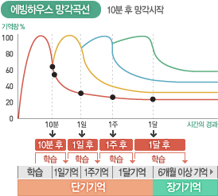

## About Learning

> 효과적인 학습은 **나무**와 같다.  

잎사귀와 열매는 가지에 의존한다. 그 가지는 줄기, 줄기는 기둥, 기둥은 뿌리에 의존한다.
이와 같이 복잡한 주제에 대한 우리의 이해는 기본적인 개념과 원리를 이해하는 데 달려있다.

학습 뿐만 아니라 객체지향성의 원리, 진화론, 물리학의 제 1원리 등 다른 분야에서도 살펴볼 수 있듯이, 우주의 설계 방식으로도 보인다.

이러한 이해를 바탕으로 취할 수 있는 단계는 다음과 같다.
1. **뿌리 찾고 기둥 세우기**: 배우고자 하는 주제에 대한 핵심 개념을 찾고 이해한다.
2. **가지 키우기**: 핵심 개념에 대한 *명확한 이해*를 바탕으로 더 큰 개념으로 확장시킨다.
3. **잎사귀 키우기**: 핵심 개념과 그것을 확장시킨 개념에 대한 이해를 바탕으로 세부적인 내용에 집중한다. 
4. **연결 고리 찾기**:  같은 나무 내에, 혹은 다른 나무와 연결 고리를 찾는다.

이러한 과정은 끝 없는 성장과 번영을 만드는 비옥한 토양을 만들어낸다.  

#### Forgetting Curve
> 효과적으로 학습한다는 건 **나무**를 키우는 것과도 같다.

우리가 정보를 잊어버리는 방식도 나무와 비슷하다.
나무는 주기적으로 물을 주지 않으면 잎사귀가 말라가고, 점차 가지, 기둥, 뿌리까지 죽어버린다.
우리 뇌는 정기적인 복습이 없으면 디테일한 정보를 먼저 잊고, 점차 핵심 개념마저 희미해진다.

건강한 나무를 키우기 위해 할 수 있는 행동은 다음과 같다.
- **정기적인 복습**: 물을 주는 것처럼 정보를 주기적으로 복습한다.
- **적극적인 문제 해결**: 가지 치기처럼 불필요한 정보를 제거한다.

